# Learning Path 4 - Lab 3 - Exercise 4 - Review Key Features of Microsoft Teams

In this exercise you will learn how to manage and configure teams through the Microsoft Teams admin center.

### Task 1 – Manage Global Meeting Policy

Meeting policies control the features that are available to participants in meetings that are scheduled by users in your organization. An organization-wide policy named Global is created by default, and all users in your organization are automatically assigned this meeting policy. You can either make changes to this policy or create one or more custom policies and assign users to them. When you create a custom policy, you can allow or prevent certain features from being available to your users, and then assign the policy to one or more users who will have the settings applied to them. 

 As Holly Dickson, Adatum's Enterprise Administrator, you want to customize the company's Global meeting policy as part of Adatum’s pilot project for implementing Microsoft Teams.

1. Switch to **LON-DC1-ID** where you should still be logged in as **ADATUM\Azureuser Administrator**; if not, then do so now.

1. On **LON-DC1-ID**, you should still have your Edge browser and the **Microsoft 365 admin center** open from the prior lab. If so, proceed to the next step; otherwise, open Microsoft Edge, navigate to **https://portal.office.com/**, log in as **Holly@xxxxxZZZZZZ.onmicrosoft.com** (where xxxxxZZZZZZ is the tenant prefix provided by your lab hosting provider) and **Pa55w.rd**, and then in the **Microsoft Office Home** page, select the **Admin** icon to open the Microsoft 365 admin center.

	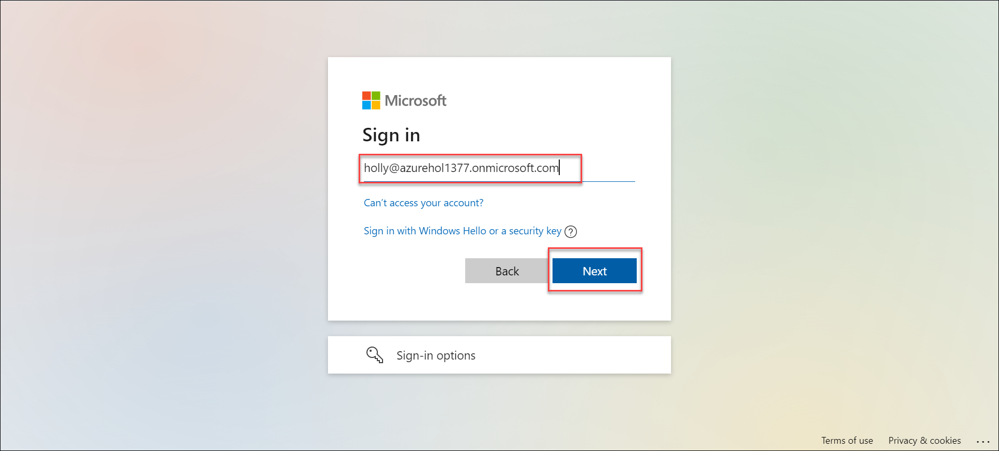
	
	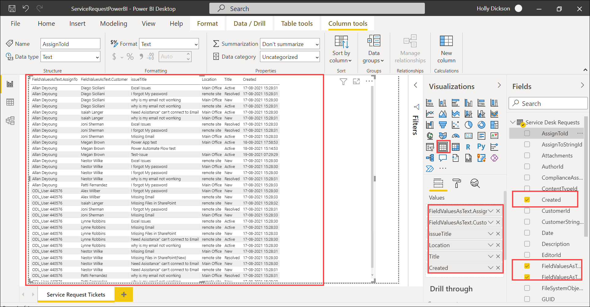
	
	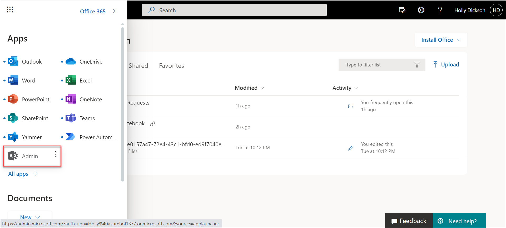

1. To start fresh in this Teams lab exercise, close all SharePoint-related tabs in your Edge browser that were left open from the previous SharePoint lab exercise. Only leave the **Microsoft Office Home** tab and the **Microsoft 365 admin center** tab open. 

1. In the **Microsoft 365 admin center** tab, in the left-hand navigation pane under the **Admin centers** section, select **Teams.** This will open the Microsoft Teams admin center.

	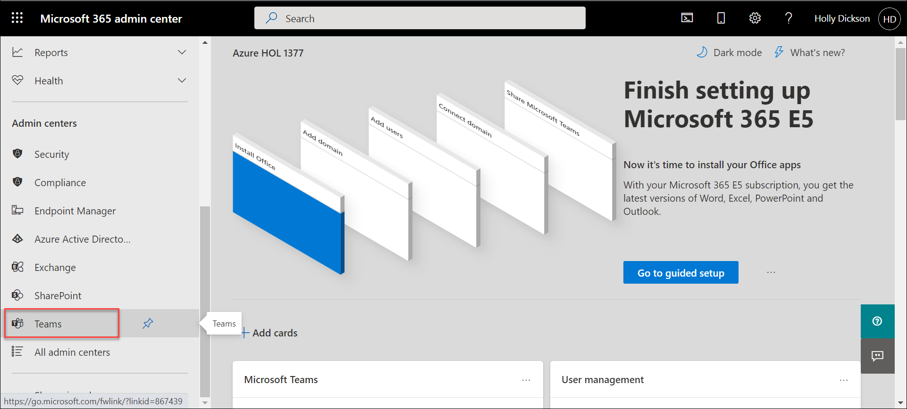
	
1. In the **Microsoft Teams admin center**, in the left-hand navigation pane, select **Meetings** and then in the drop=down menu, select **Meeting policies**.

	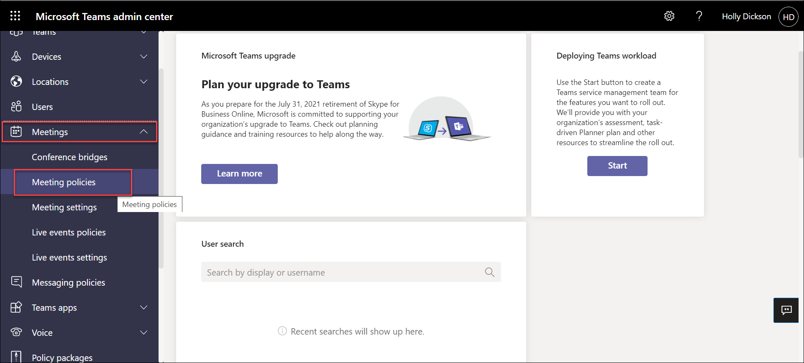

1. In the **Meeting policies** window, scroll down to the list of meeting policies and select **Global (Org-wide default)**. 

	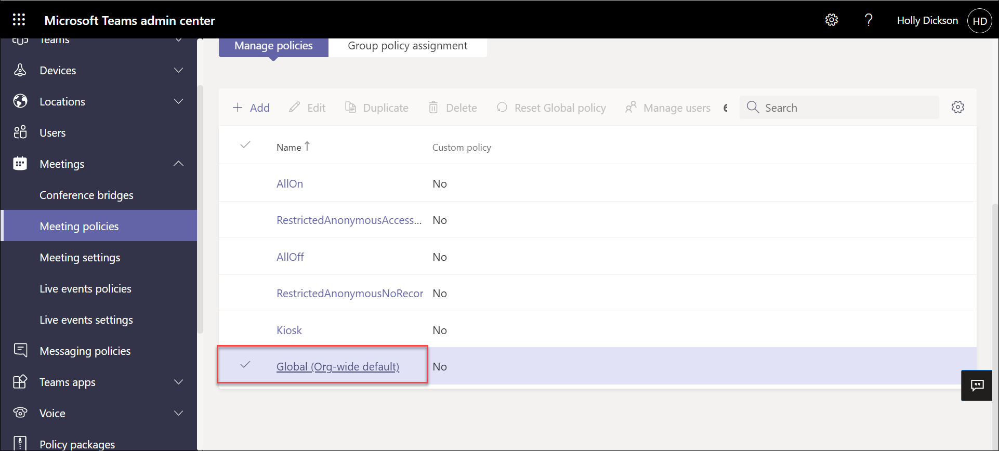

1. In the **Global** window that appears, under the **General** section, review each setting. All settings in this section should be turned **On**.

	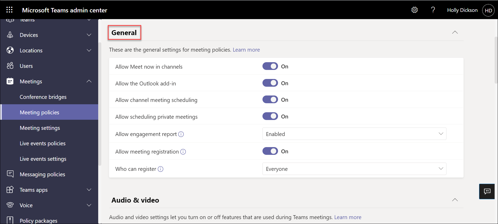

1. Under the **Audio &amp; video** section, review each setting. Under the **Recording and transcription** section, Select the **Allow transcription** toggle switch to turn it **On**.

	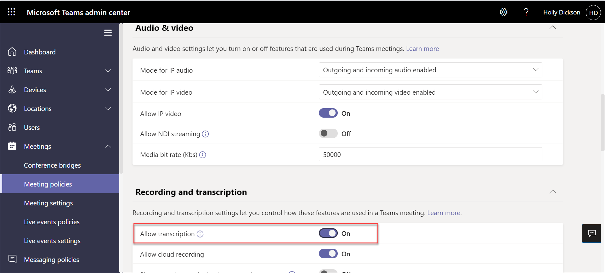
	
1. Under the **Content Sharing** section, review each setting and make the following changes: 

	Set the **Screen sharing mode** to **Single application**.
	Set the **Allow an external participant to give or request control** setting to **On**.

	

1. Under the **Participants &amp; guests** section, review each setting. 

	Because Adatum has had issues in the past with non-invited external users dialing into meetings, you have been asked to verify the **Allow dial-in users to bypass the lobby** option is set to **Off**; if this option is turned On, then change it to Off. This setting controls whether people who dial in by phone will automatically join the meeting or must wait in the lobby until they are admitted to the call. 
	
	Because the **Automatically admit people** setting is set to **people in my organization**, anyone who dials-in will wait in the lobby until admitted; this includes both Adatum and non-Adatum participants. You may decide to turn this setting **On** if it proves to be problematic in practice, but for now, you want to begin with this level of control. 

	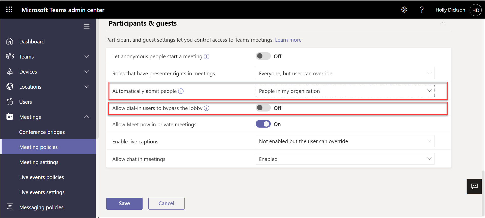

1. Scroll to the bottom of the page and select **Save**.

	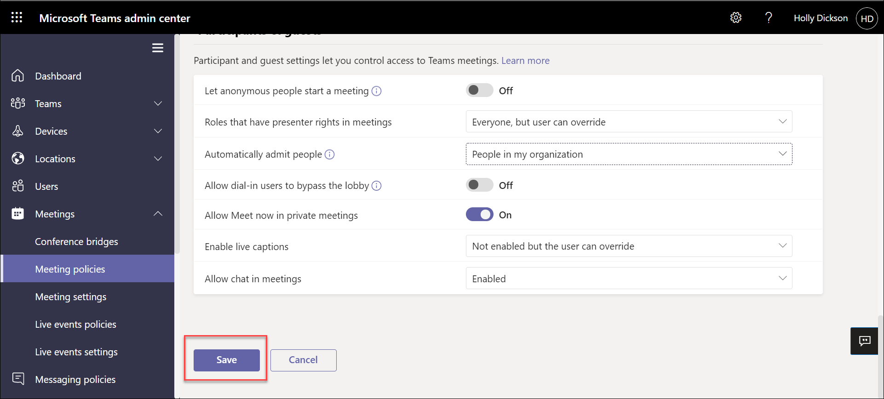

1. Leave all tabs open in your browser and proceed to the next task. 

### Task 2 – Manage Meeting Settings

As Holly Dickson, Adatum’s Microsoft 365 Enterprise Administrator, you use the Teams meetings settings to control whether anonymous users can join Teams meetings and customize meeting invitations. You can also use these settings to enable Quality of Service (QoS) and set port ranges for real-time traffic. These settings apply to all Teams meetings that users schedule in your organization. As part of Adatum’s pilot project for implementing Microsoft Teams, you want to configure Teams meeting settings to see how they handle email invitations.

1. On **LON-DC1-ID**, you should still be logged in as the Adatum Azureuser Administrator, and you should still be logged into Microsoft 365 in your Edge browser as Holly Dickson. 

1. In your Edge browser, in the **Microsoft Teams admin center**, under the **Meetings** group in the left-hand navigation pane, select **Meeting settings.**

	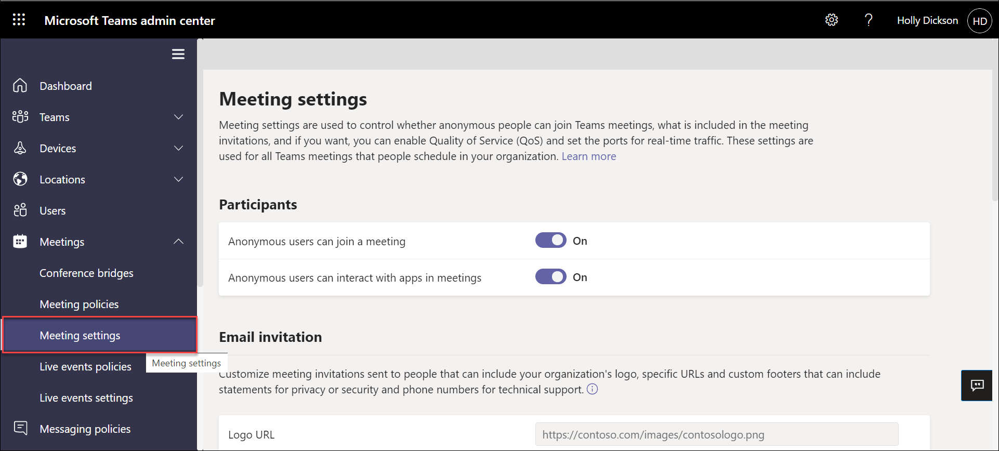

1. On the **Meetings settings** page, under the **Email invitation** section, enter the following information:

	- Logo URL: **https://adatum.com/media/adatumlogo.png** (Hint: copy **https://adatum.com/** so that you can paste it into the next two URLs; this will save you from having to type that portion of the URL each time)

	- Legal URL: **https://adatum.com/legal.html**

	- Help URL: **https://adatum.com/joiningmeetinghelp.html**

	- Footer: **Please accept at your earliest convenience. Thank you!**

1. Select the **Preview invite** button.

	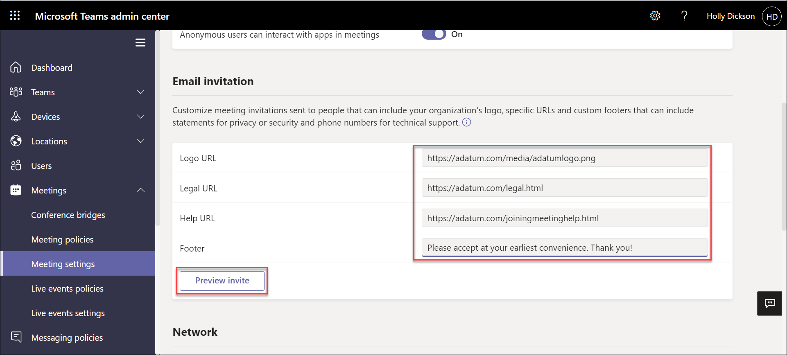	

1. Review the preview image of the invitation and then scroll down to the bottom of the preview window and select **Close**.

	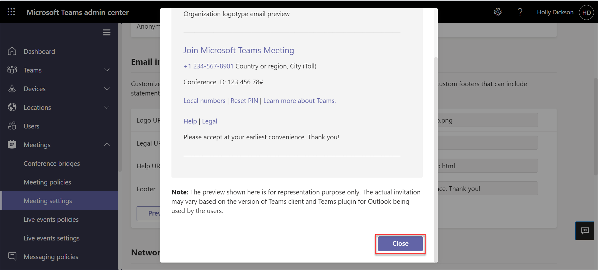

1. On the **Meetings settings** page, under the **Network** section, review the current settings.  

	‎**Note:** If you have specific ports that your company uses for sending and receiving media traffic, this is where you would enter those ports. If you do not have specific media ports prescribed by your network administrator, then you would leave this section alone. For the purposes of this lab, you will not update this section. 

1. Scroll to the bottom of the page and select **Save**.

	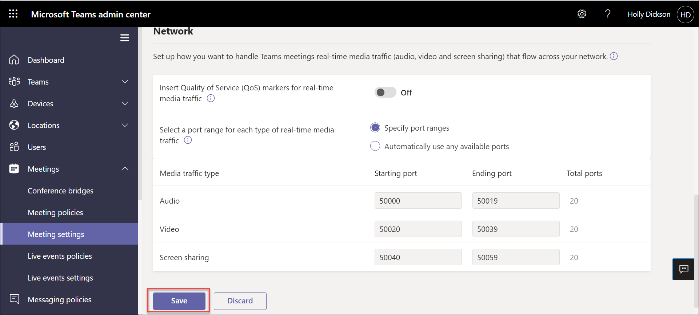

1. Leave all tabs open in your browser and proceed to the next task. 

### Task 3 – Manage Messaging Policies

Messaging policies are used to control which chat and channel messaging features are available to users in Microsoft Teams. You can use the Global default policy that is created automatically or create one or more custom messaging policies for people in your organization. After you create a policy, you can assign it to a user or group of users in your organization. 

As part of her Microsoft Teams pilot project for Adatum, Holly wants to create a new messaging policy that addresses the chat and channel messaging requirements set forth by Adatum’s project team. 

1. On **LON-DC1-ID**, you should still be logged in as the Adatum Azureuser Administrator, and you should still be logged into Microsoft 365 in your Edge browser as Holly Dickson. 

1. In your Edge browser, in the **Microsoft Teams admin center**, select **Messaging policies** in the left-hand navigation pane.

1. In the **Messaging policies** window, only the **Global (Org-wide default)** policy exists. Select **+Add** in the menu bar that appears above the list of policies.

	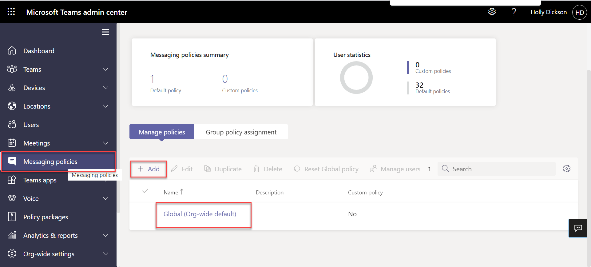	

1. Select the **New messaging policy** field at the top of the page and enter **Chat and Channel Messaging Policy** as the name of the policy.

	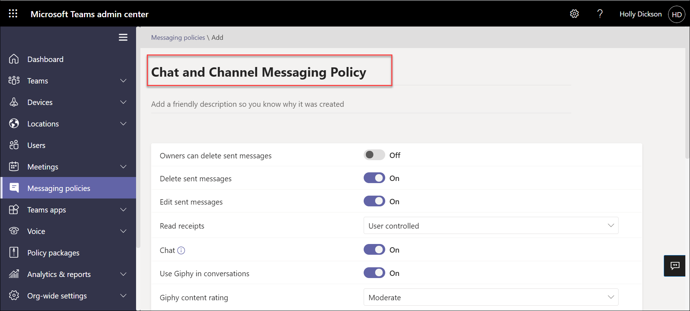

1. Select the following values for each setting:

	- Owners can delete sent messages: **Off**

	- Delete sent messages: **Off**

	- Edit sent messages: **On**

	- Read receipts: **Turned on for everyone**

	- Chat: **On** 

	- Use Giphy in conversations: **Off**

	- Giphy content rating: **Strict**

	- Use Memes in conversations: **Off**

	- User Stickers in conversations: **Off**

	- Allow URL previews: **On**

	- Translate messages: **On**

	- Allow immersive reader for viewing messages: **On**

	- Send urgent messages using priority notifications: **On** 

	- Create voice messages: **Allowed in chats and channels**

	- On mobile devices, display favorite channels about recent chats: **Not enabled**

	- Remove users from a group chat: **Off**
	
	- Suggested replies: **Off**

1. Select **Save.** 

	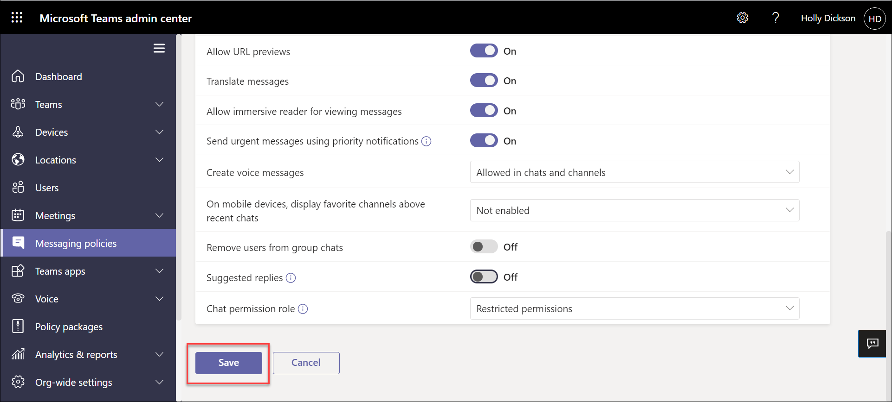

1. Leave all tabs open in your browser and proceed to the next task. 

### Task 4 – Create a Resource Account

A resource account, which is referred to as a disabled user object in Azure Active Directory, can be used to represent resources in general. For example, a resource account in Exchange can be used to represent conference rooms, and in Microsoft Teams, resource accounts can be used to represent Phone System call queues and auto attendants. 

As part of Adatum’s pilot project for implementing Microsoft Teams, Holly Dickson has been asked to create a resource account for a cloud call queue, which is a service that accepts customer calls, plays a greeting message, and then places the customer calls in a wait queue while searching a pre-configured list of agents to answer each call. 

Creating a calling queue is a two-step process. In this task, you will first create a resource account that represents the call queue. In the next task, you will create the actual call queue and associate it with this resource account. 

1. On **LON-DC1-ID**, you should still be logged in as the Adatum Azureuser Administrator, and you should still be logged into Microsoft 365 in your Edge browser as Holly Dickson. 

1. In your Edge browser, in the **Microsoft Teams admin center**, select **Org-wide Settings** in the left-hand navigation pane and then select **Resource accounts.**

	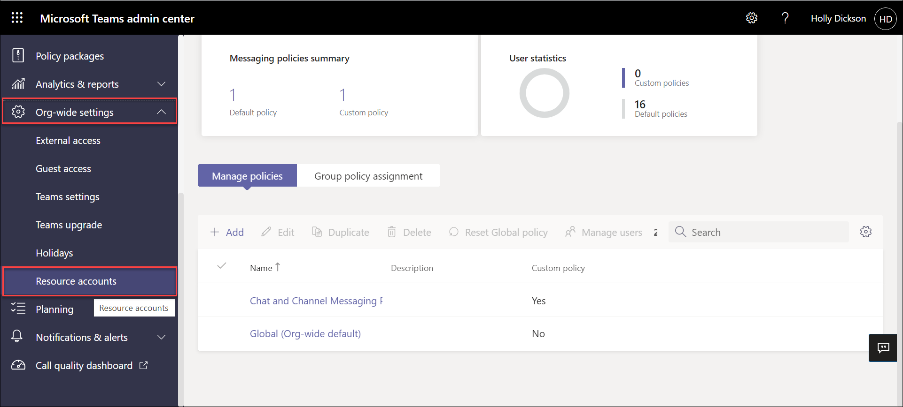

1. In the **Resource accounts** window, select **+Add** in the menu bar at the top of the page.

	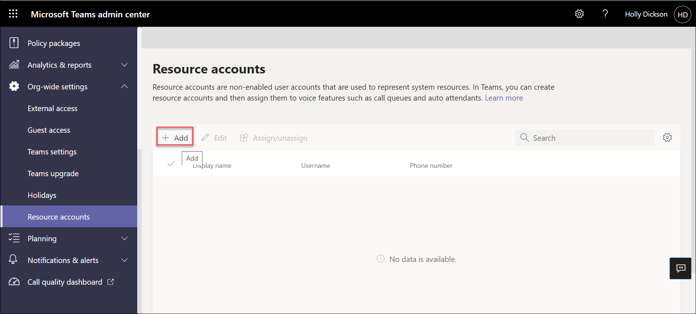

1. In the **Add resource account** pane that appears on the right, enter the following information:

	- Display name: **Calling Queue 1**

	- Username: **CQ1**

	- Domain name: In the domain name field to the right of the username, select the drop-down arrow and select **xxxxxZZZZZZ.onmicrosoft.com** (where xxxxxZZZZZZ is the tenant prefix provided by your lab hosting provider)

	- Resource account type: **Call queue**

1. Select **Save**. **Calling Queue 1** will now appear in the list of **Resource accounts**. 

	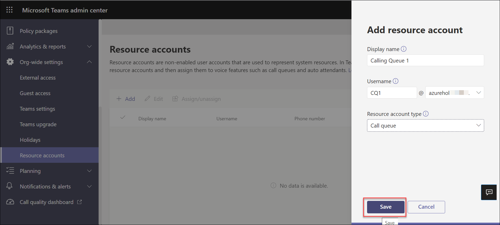
	
	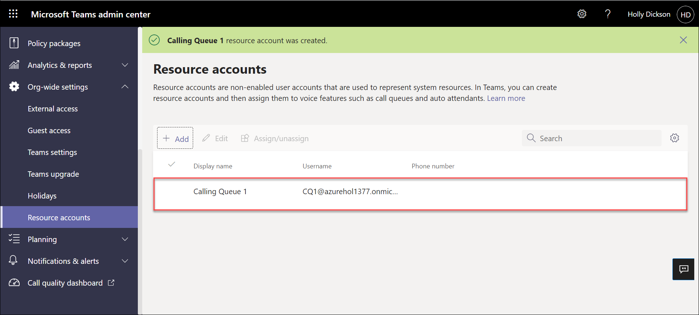

1. Leave all tabs open in your browser and proceed to the next task. 

### Task 5 - Create a Call Queue

Now that you have created the resource account for your calling queue, you will create the call queue itself and assign it the resource account.

1. On **LON-DC1-ID**, you should still be logged in as the Adatum Azureuser Administrator, and you should still be logged into Microsoft 365 in your Edge browser as Holly Dickson. 

1. In your Edge browser, in the **Microsoft Teams admin center**, select **Voice** in the left-hand navigation pane and then select **Call queues.**

1. In the **Call queues** window, select **+Add** in the menu bar at the top of the page.

	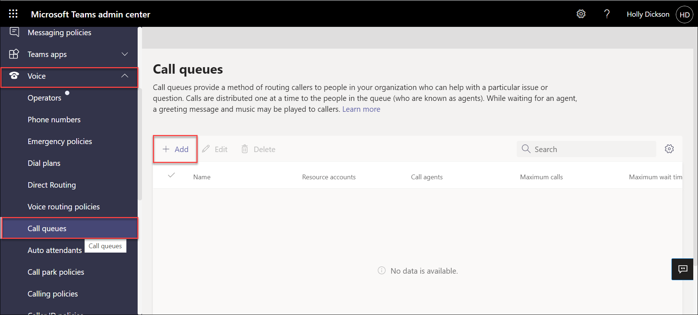

1. Select the **Call queue name** field at the top of the page and enter **Call Queue 1** as the name of the queue.

1. The page displays a message indicating **You haven’t added any resource accounts yet.** Below this message, select the **Add accounts** button.

	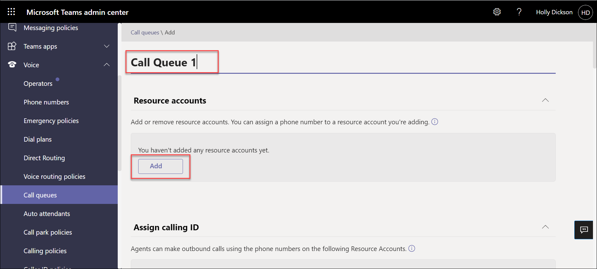

1. In the **Add account** pane that appears on the right-side of the screen, in the **Search by display or username** field, enter **Calling**. As you type **Calling**, a window appears that displays resource accounts whose title starts with **Calling**. **Calling Queue 1** is displayed. As you hover your mouse over **Calling Queue 1**, an **Add** button appears to the right of it. Select the **Add** button.

	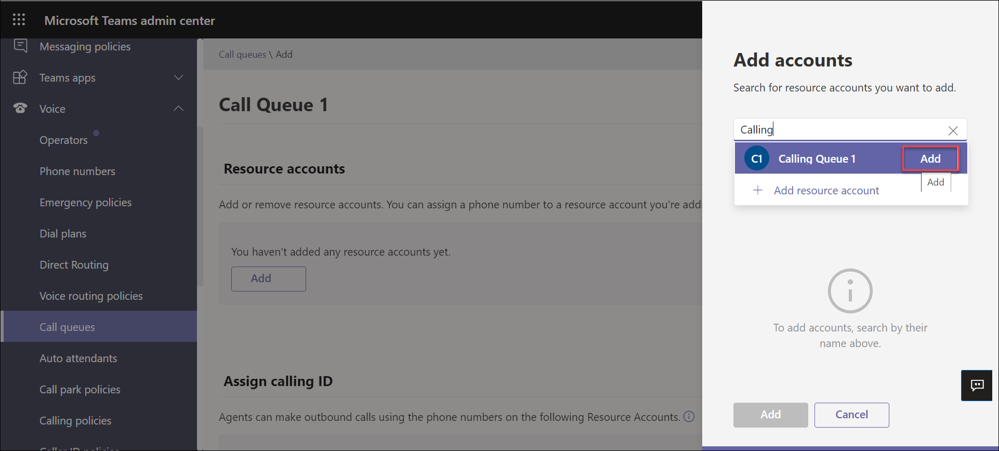

1. At the bottom of the **Add accounts** pane, select **Add**. This returns you to the **Call Queue 1** window, which now displays **Calling Queue 1** in the list of Resource accounts associated with this call queue, select **Add**.

	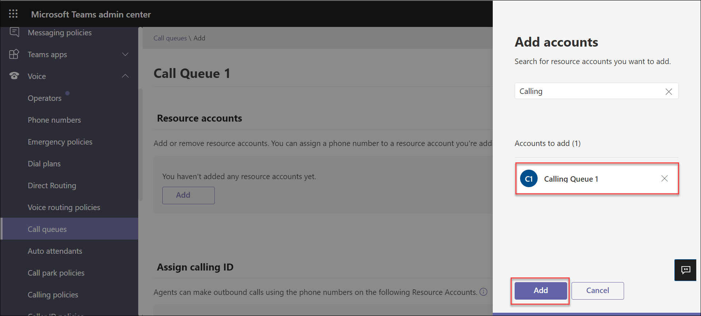

1. In the **Call Queue 1** window, scroll down the page and select the following values for each option:
	
	- Language: **English (United States)**

	- Greeting: **No greeting**

	- Music on hold: **Play default music**

	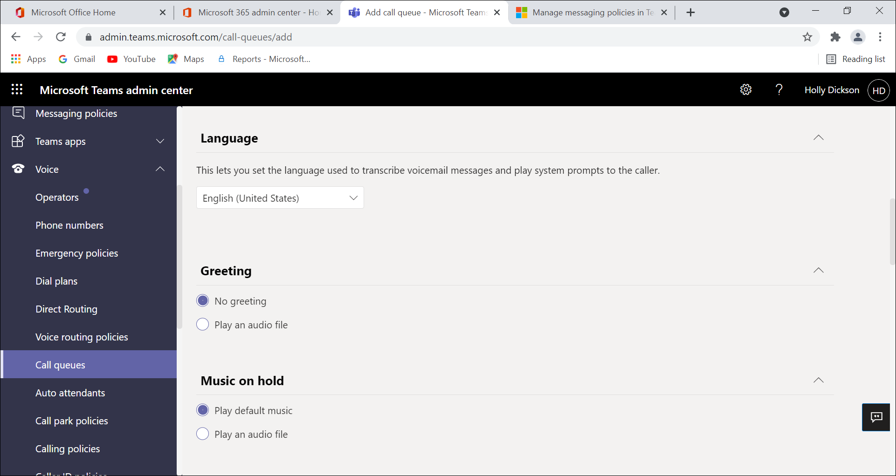
	
	- Call answering: 

		- **Choose which call agents to associate with this call queue:** Select the **Choose users and groups** option, then select **Add users**. In the **Add users** pane that appears on the right-side of the screen, in the **Search by display name or username** field, enter **Allan**. As you type **Allan**, a window appears listing users whose name starts with **Allan**. As you hover your mouse over **Allan Deyoung**, an **Add** button appears to the right of it. Select the **Add** button.
		
			**Important:** Note the red error message that appears across the top of the page. The error message indicates that Allan cannot be associated with this call queue because he is not enterprise-voice enabled. Select anywhere in the red error message to close the **Add users** pane, and then select the **X** on the right-side of this error message to close it.

		- **Choose which groups to associate with this call queue:** Select the **Add groups** button. In the **Add call agents** pane on the right-side of the screen, in the **Search by distribution list or group name** field, enter **Inside**. As you type Inside, a window appears listing the groups whose name starts with Inside. As you hover your mouse over **Inside Sales**, an **Add** button appears to the right of it. Select the **Add** button. In the **Add call agents** pane, the Inside Sales group appears under **Selected groups**. Select the **Add** button at the bottom of the pane.
	       
		-  Routing Method: **Round Robin**   
	        
	        -  Presence-based routing - **Off**
	
	        - Agents can opt out of taking calls: **On**
		
	        - Agent alert time (in seconds) - **45** (Hint: Entering the value in the field is easier than dragging the slider icon)

	        - Call overflow handling: **leave all settings to their default values**

	        - Call time out handling: **leave all settings to their default values**

1. Select **Save**. A Saved message will appear across the top of the page once the changes have been saved. This message will eventually disappear, and **Call Queue 1** will appear in the list of Call queues.

	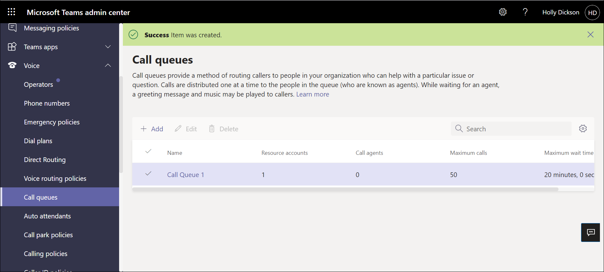

1. Leave all tabs open in your browser and proceed to the next task. 

### Task 6 - Create a Calling Policy 

In Microsoft Teams, calling policies control which calling and call forwarding features are available to users. Calling policies determine whether a user can make private calls, use call forwarding or simultaneous ringing to other users or external phone numbers, route calls to voicemail, send calls to Call Groups, use delegation for inbound and outbound calls, and so on. A default global policy is created automatically, but admins can also create and assign custom calling policies. 

As part of her Microsoft Teams pilot project, Holly Dickson has been tasked with creating a custom calling policy for Adatum. Instead of customizing the default global policy, she will follow best practice guidelines and create her own customized policy that will be used as Adatum’s default policy.

1. On **LON-DC1-ID**, you should still be logged in as the Adatum Azureuser Administrator, and you should still be logged into Microsoft 365 in your Edge browser as Holly Dickson. 

1. In your Edge browser, in the **Microsoft Teams admin center**, select **Voice** in the left-hand navigation pane and then select **Calling policies.**

	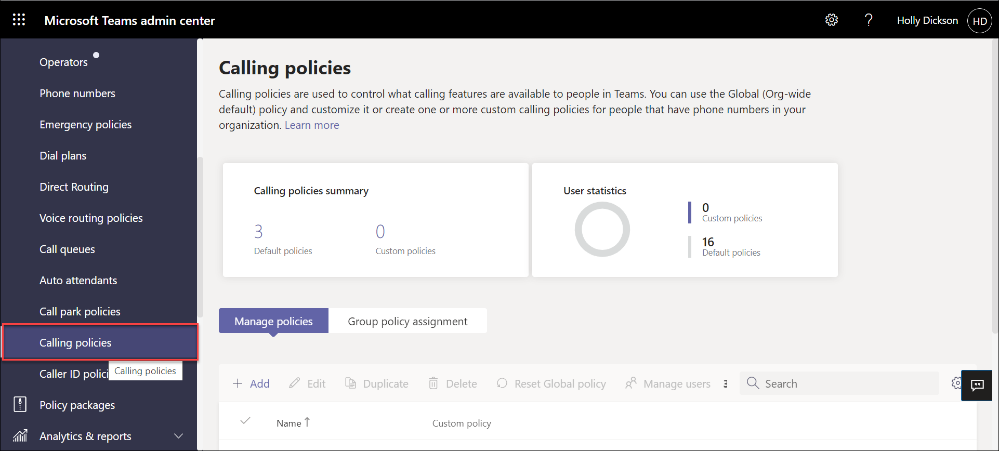

1. In the **Calling policies** window, scroll down through the list to see the predefined calling policies, and then select **+Add** in the menu bar that appears above the list of calling policies.

	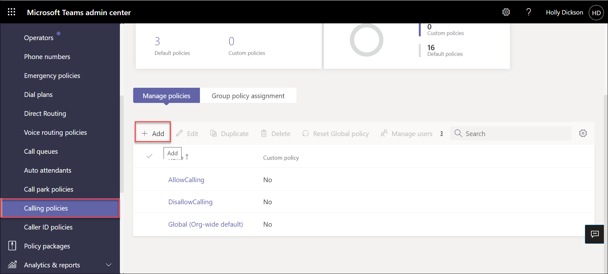

1. Select the **Add new calling policy** field at the top of the page and enter **Default Adatum Calling Policy** as the name of the policy. 

	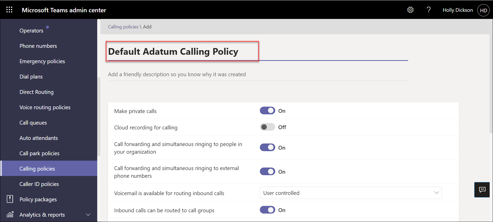

1. Scroll down the page and select the following values for each setting:

	- Make private calls: **On**

	- Call forwarding and simultaneous ringing to people in your organization: **Off**

	- Call forwarding and simultaneous ringing to external phone numbers: **On**

	- Voicemail is available for routing inbound calls: **Enabled**

	- Inbound calls can be routed to a call group: **On**

	- Delegation for inbound and outbound calls: **Off**

	- Prevent toll bypass and send calls through the PSTN: **On**

	- Busy on busy when in a call: **Enabled**
	
	- Allow web PSTN calling: **On**

1. Select **Save**. A Saved message will appear across the top of the page once the changes have been saved. This message will eventually disappear, and **Default Adatum Calling Policy** will appear in the list of Calling policies. Note how it is flagged as a Custom policy in the list.

	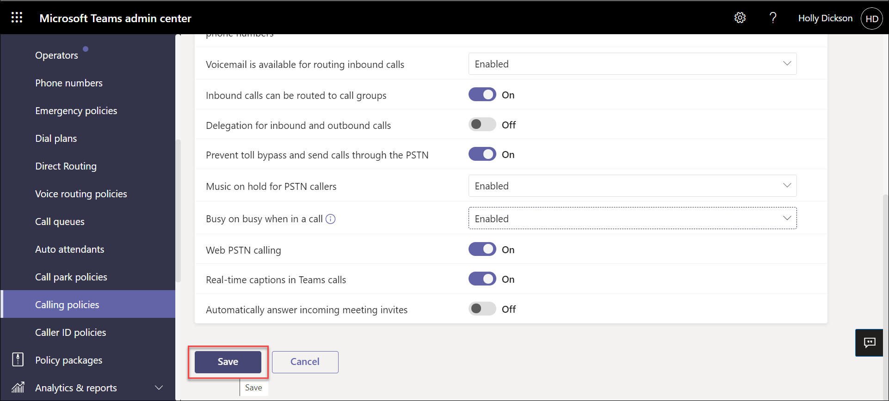
	
	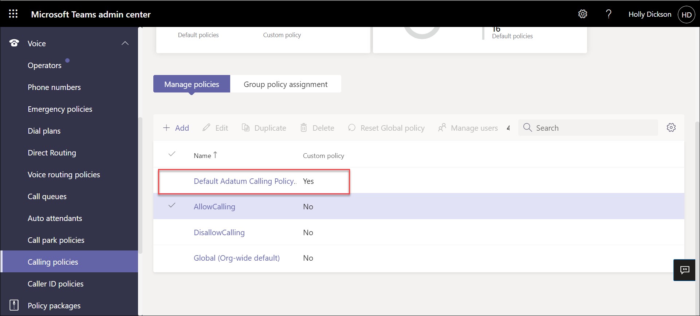

1. Leave all tabs open in your browser and proceed to the next task. 
 

### Task 7 – Manage External Access

With Microsoft Teams’ external access feature, Teams users from other domains can participate in your chats and calls. You can also block the users in specific domains from joining chats and calls. 

As part of her Microsoft Teams pilot project, Holly Dickson wants to block communication with users from a specific domain (spam.com) that has been the source of multiple spam attacks within Adatum over the past year. At the same time, Holly wants to allow communication with the users from another domain (microsoft.com) that is one of Adatum's key business partners.

1. On **LON-DC1-ID** , you should still be logged in as the Adatum Azureuser Administrator, and you should still be logged into Microsoft 365 in your Edge browser as Holly Dickson. 

1. In your Edge browser, in the **Microsoft Teams admin center**, select **Org-wide settings** in the left-hand navigation pane and then select **External access.**

	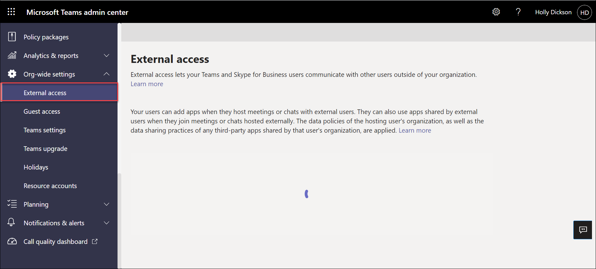

1. In the **External access** window, leave the two settings involving Skype for Business/Teams and Skype users set to **On**. Also note that in the list of domains, the domain of the IT Consultant who helped formulate the new Service Request Ticketing system (**xxxxxZZZZZZonmicrosoft.com**) appears in the list, and that communication is Allowed with this domain. You added this domain back in Lab 1. 

1. To add the domain in which you want to allow communication, select **+Add a domain** in the menu bar that appears above the list.  

	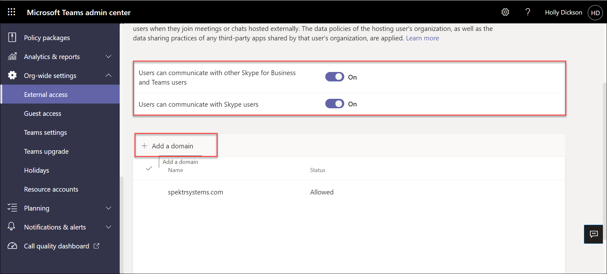

1. In the **Add a domain** window, enter the following information:

	- Domain: **microsoft.com**

	- Action to take on this domain: **Allowed**

1. Select **Done.** 

	

1. To add the blocked domain, in the **External access** window, select **Add a domain.**

	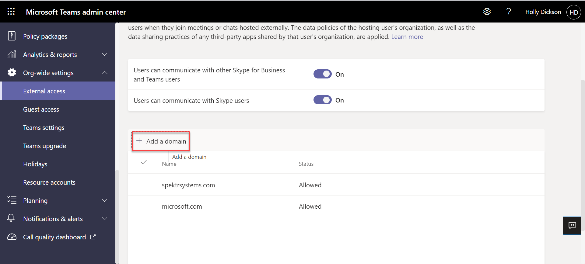

1. In the **Add a domain** pane that appears on the right, enter the following information:

	- Domain: **spam.com**

	- Action to take on this domain: **Blocked**

1. Select **Done.**

	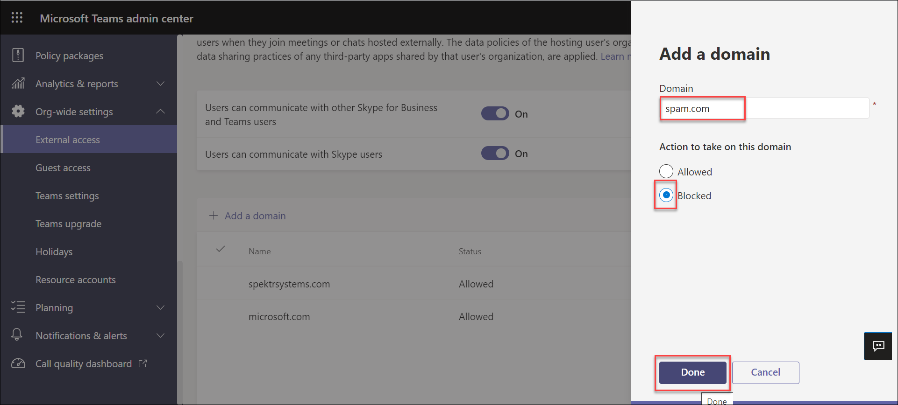

1. In the **External access** window, validate that **microsoft.com** and **spam.com** are represented in the list of domains and that each has the appropriate Status.

1. Select **Save.**

	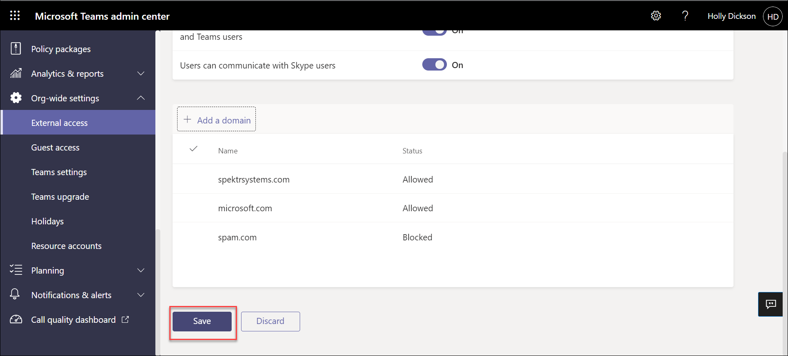

1. Leave all tabs open in your browser and proceed to the next task. 

### Task 8 – Manage Guest Access

Microsoft Teams’ guest access feature is a tenant-level setting that is turned Off by default. Once this setting is turned On, you can configure settings for guests. IT admins can add guests at the tenant level, set and manage guest user policies and permissions, and generate reports on guest user activity. 

As part of your Microsoft Teams pilot project for Adatum, you will turn on guest access and then customize a variety of the guest settings as defined by Adatum’s project team.

1. On **LON-DC1-ID**, you should still be logged in as the Adatum Azureuser Administrator, and you should still be logged into Microsoft 365 in your Edge browser as Holly Dickson. 

1. In your Edge browser, in the **Microsoft Teams admin center**, under **Org-wide settings** in the left-hand navigation pane select **Guest access.**	

1. In the **Guest access** window, set the **Allow guest access in Teams** setting to **On**. 

	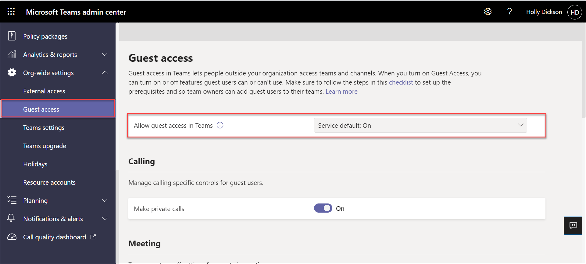

1. Once you set this switch to **On**, a variety of additional settings are displayed. Scroll down the page and select the following values for each setting:

	- Calling

		- Make private calls: **Off**

	- Meeting

		- Allow IP video: **On**

		- Screen sharing mode: **Entire screen**

		- Allow Meet Now: **On**

	- Messaging

		- Edit sent messages: **Off**

		- Delete sent Messages: **Off**

		- Chat: **On**

		- Use Giphy in conversations: **Off**

		- Giphy content rating: **Strict**
	
		- Use Memes in conversations: **Off**

		- User Stickers in conversations: **Off**

		- Allow immersive reader for viewing messages: **On**
	
1. Select **Save.** Note the message that displays indicating it can take a couple of hours for the changes to take effect. This message does not automatically disappear, so close this message by selecting the **X** that appears at the right-side of the message; otherwise, the message will remain at the top of your screen even as you navigate to other pages.

	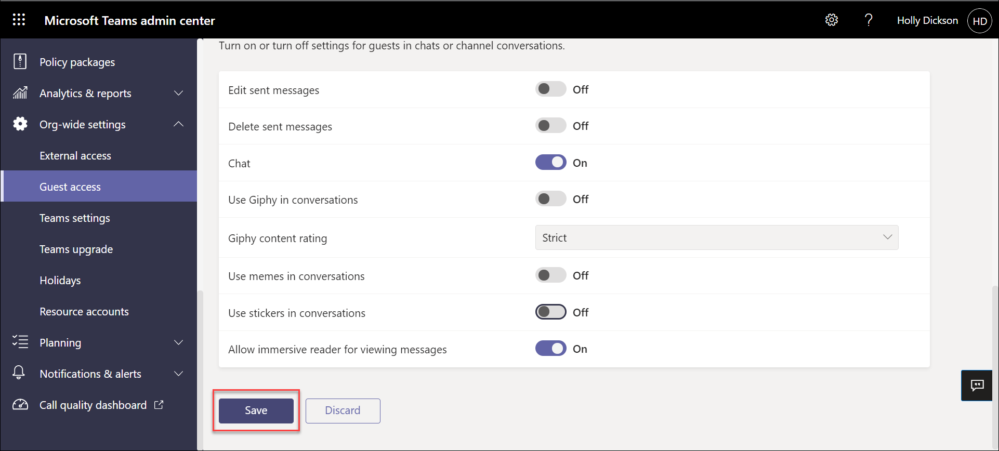
	
	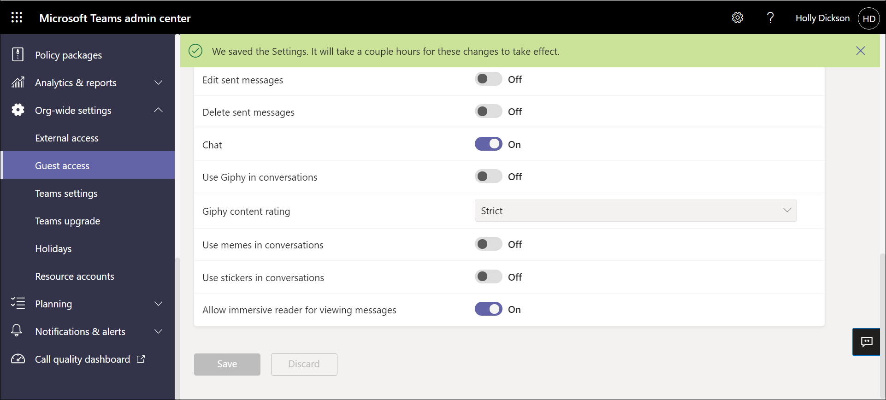

1. Leave all tabs open in your browser and proceed to the next task. 

### Task 9 – Manage Teams Settings

Microsoft Teams includes a variety of global settings that control performance within Teams. As part of her Microsoft Teams pilot project, Holly Dickson will configure a number of these settings as determined by Adatum’s project team.

1. On **LON-DC1-ID**, you should still be logged in as the Adatum Azureuser Administrator, and you should still be logged into Microsoft 365 in your Edge browser as Holly Dickson. 

1. In your Edge browser, in the **Microsoft Teams admin center**, under **Org-wide settings** in the left-hand navigation pane select **Teams settings.**

	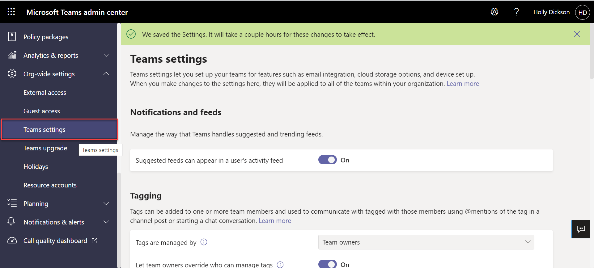

1. In the **Teams settings** window, select the following values for each setting:

	- Notifications and feeds
	
		- Suggested feeds can appear in a user's activity feed: **On**
		
	- Tagging
		
		- Tags are managed by: **Not enabled**

	- Email integration

		- Allow users to send emails to a channel email address: **On**

		- Accept channel email from these SMTP Domains: **microsoft.com**

	- Files

		- Citrix files: **On**

		- DropBox: **On**

		- Box: **Off**

		- Google Drive: **On**

		- Egnyte: **Off**

	- Organization

		- Show Organization tab in chats: **On**

	- Devices

		- Require a secondary form of authentication to access meeting content: **No access**

		- Set content PIN: **Required for outside scheduled meeting**

		- Resource accounts can send messages: **On**

	- Search by name

		- Scope directory search using an Exchange address book policy: **On**

1. Select **Save**. Note the message that displays indicating it can take a few hours for the changes to take effect. This message will eventually disappear.

	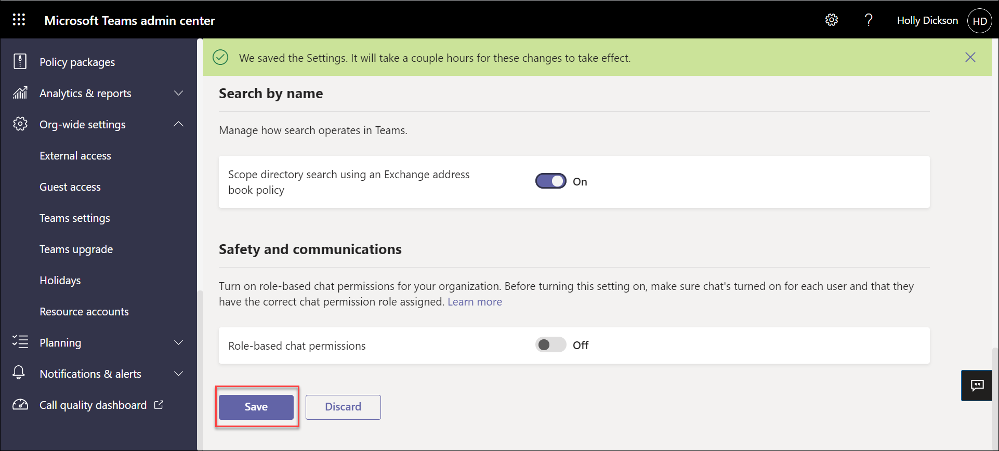

1. Leave all tabs open in your browser and proceed to the next task. 

### Task 10 – Configure Chat functionality for the Ticketing System

In this task, you will open the Microsoft Teams desktop application on LON-CL1-ID and log in as Adatum’s ODL_user_id Administrator. You will then conduct a brief chat session with the IT Consultant. This will validate that you can use Teams to chat with the IT Consultant whenever necessary to discuss matters concerning the new Service Request Ticketing system. 

1. Switch to **LON-DC1-ID**, where you should still be logged in as **ADATUM\Azureuser Administrator**; if not, then do so now. 

1. If the **Microsoft Teams** icon appears on the taskbar, then select it now; otherwise, navigate to the desktop and double-click the **Microsoft Teams** icon. Maximize the Microsoft Teams window (if necessary).

1. You want to sign into Microsoft Teams as Adatum’s odl_user_id Administrator. If you receive a log-in screen, then log in as **odl_user_id@xxxxxZZZZZZ.onmicrosoft.com** (where xxxxxZZZZZZ is the tenant prefix provided by your lab hosting provider), and enter your password as provided in the environment details tab.

	However, if the Teams app opens without displaying the log-in screen, or if Teams was already open, you should check the user icon circle in the upper right corner of the screen. If the circle displays **04** (for your odl_user_id Administrator), then proceed to the next step. 
	
	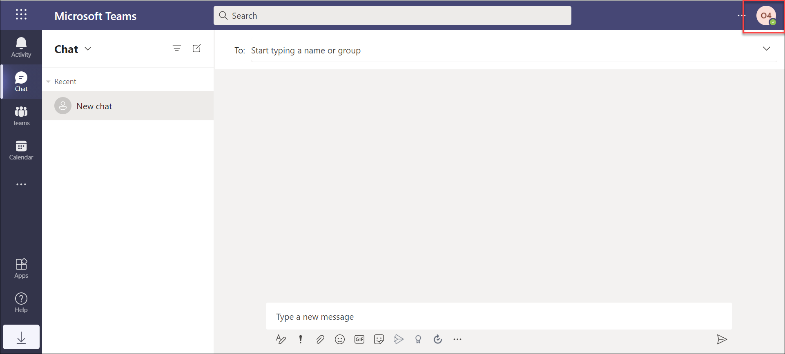
	
	If any value other than **04** is displayed in the circle, then you are not logged in as the odl_user_id Administrator. In this case, select the circle, and in the menu that appears, select **Sign out**. Then proceed through the sign-in process and log in as **Odl_user_id@xxxxxZZZZZZ.onmicrosoft.com** (where xxxxxZZZZZZ is the tenant prefix provided by your lab hosting provider), and enter your password as provided in the environment details tab.

1. In **Microsoft Teams**, in the left-hand navigation pane, select **Chat**.

	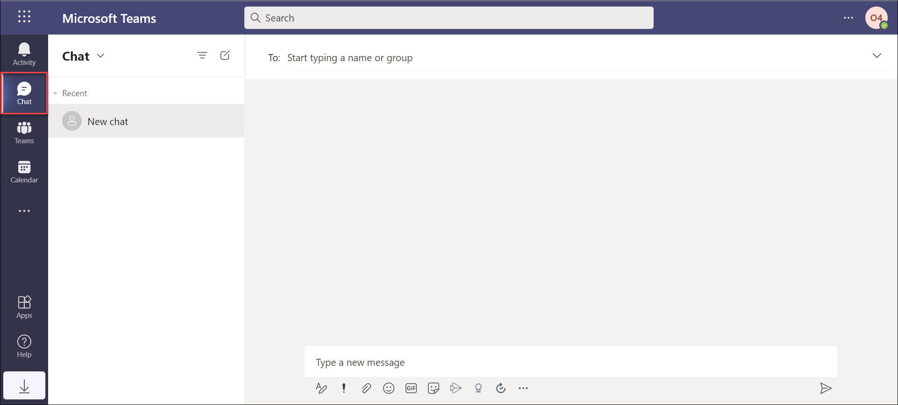

1. On the very top row on the screen, to the right of the **Chat** command is a **Filter** icon and a **New Chat** icon (a pencil inside a square). Select this **New Chat** icon. 

	

1. This opens a new chat window in the main body of the page. You want to chat with Holly Dickson; therefore, in the **To: Start typing a name or group** field, enter the Holly Dickson account of **HollyDickson@xxxxxZZZZZZ.onmicrosoft.com**. and then press **Enter**. 

1. It should display the result of this search below the **To:** field. Select this value. 

	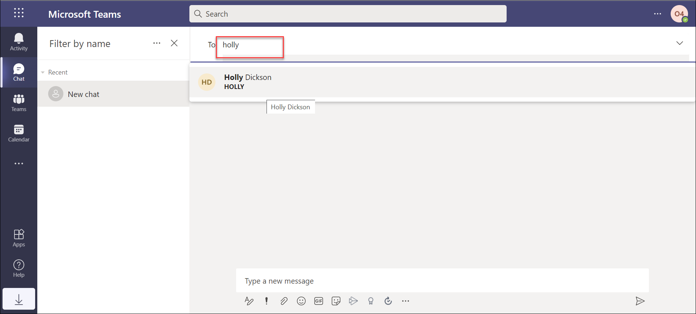

1. This will open a new chat session. Send a message to this person and conduct a brief chat session to verify that you can communicate with him or her using the Chat functionality within Teams.

1. When you have finished chatting, leave Teams open and proceed to the next task. 

# Proceed to Lab 3 - Exercise 5
