# Learning Path 4 - Lab 3 - Exercise 8 - Create a flow using Power Automate

In your role as Holly Dickson, Adatum’s Enterprise Administrator, you have built a new service desk ticketing system in SharePoint that consists of a team site titled **IT Services** and a SharePoint list titled **Service Desk Requests**. In your effort to implement Microsoft’s Power Platform at Adatum, you then created a Power App that enables users to enter service tickets using the app rather than SharePoint, and you also added the app to Microsoft Teams so that users can access the Power App through Teams. 

As part of your Power Platform pilot project, you now want to investigate how you can use Power Automate to improve your new ticketing system. After reviewing Adatum’s old ticketing system, you realized that a lack of real-time communication between managers and customers (your internal users) was a key factor in its ineffectiveness. To address this issue, you have decided to build and share an automated flow within Power Automate that automatically sends an email to the ODL Administrator whenever a service request is created or modified.
 

### Task 1 - Create a Power Automate Flow

To improve communication between management and internal users, Holly Dickson has decided to build and share an automated flow within Power Automate that sends an email to  **ADATUM\Azureuser Administrator** whenever a service request is created or modified. This task will focus on creating the flow; the next task will address how to share the flow with another manager. 

1. After having completed the prior lab exercise in which you created a Power App from scratch, you should still be logged into your Domain Controller VM (**VM-Deployment-ID**) as **ADATUM\Azureuser Administrator** and a password of **Pa55w.rd**; if not, then do so now.

2. In your Microsoft Edge browser, make sure that your new ticketing system is open in a tab. The tab should be titled **IT Services – Service Desk Requests – All Items**. If you do not have this tab open, then go to the **SharePoint admin center**, select **Active Sites**, select **IT Services** from the **Active Sites** list, select **Site contents**, and then select the **Service Desk Requests** list. 

   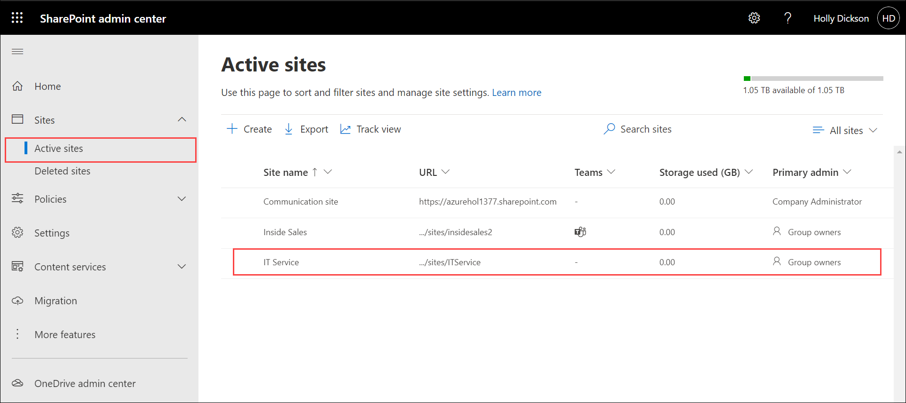
   
   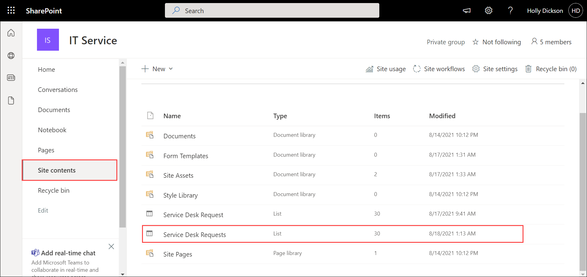

3. In your Edge browser, you want to open the Power Automate studio. Open a new tab in the browser and enter the following URL in the address bar:  **https://flow.microsoft.com**   
‎  
‎On the **Microsoft Power Automate** screen, select **Sign in** at the top of the screen. 

4. If you are not already signed in with your corporate account, you will be prompted for your credentials, in which case you should enter **Holly@xxxxxZZZZZZ.onmicrosoft.com** (where xxxxxZZZZZZ is the tenant prefix provided by your lab hosting provider) and a password of **Pa55w.rd**. 

   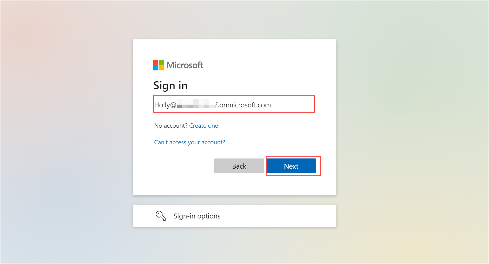
   
   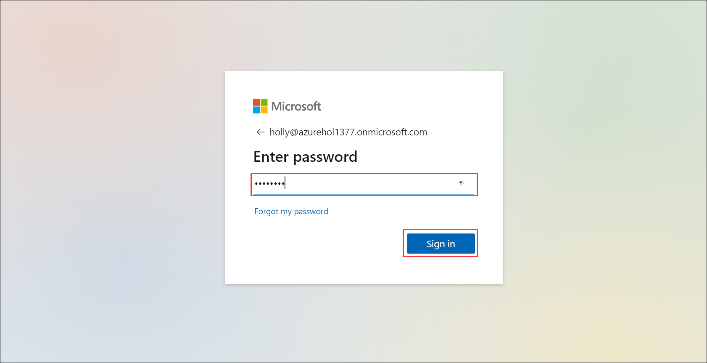

5. In the **Welcome to Power Automate** screen, select your **country/region** from the drop-down list and then select **Get Started**. 

6. On the **Power Automate studio** screen, validate that Holly Dickson’s initials (**HD**) appear in the user icon in the upper right corner of the screen. If this user icon is someone other than Holly, then select the user icon, select **Sign out**, and then sign back in as Holly **Holly@xxxxxZZZZZZ.onmicrosoft.com**, where xxxxxZZZZZZ is the tenant prefix provided by your lab hosting provider) and a password of **Pa55w.rd**. 

   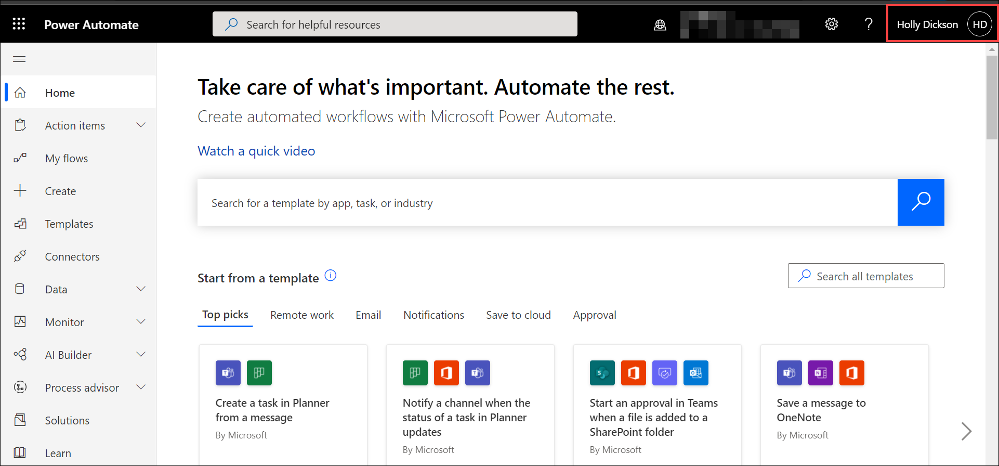

7. From the left navigation pane, select **+ Create.**

   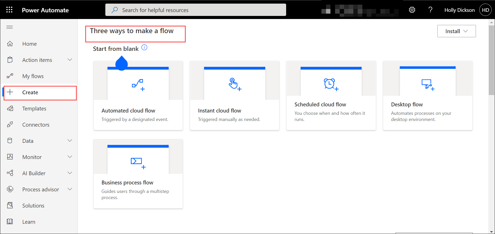

8. On the **Three ways to make a flow** page, scroll down on the landing page until you see **Start from connector**, and then select **SharePoint**.

   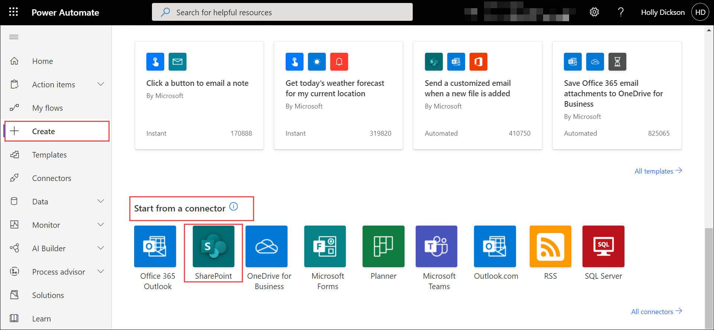

9. On the **SharePoint** page, scroll down to view SharePoint triggers and templates. 

10. In the list of triggers, select **When an item is created or modified**.

   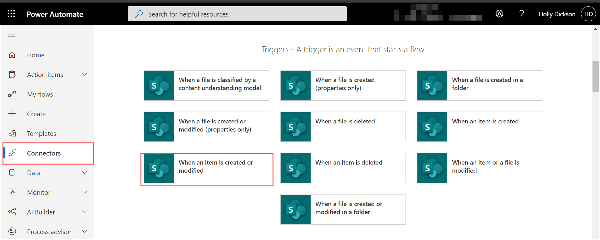

11. On the **When an item is created or modified** window appears, select the drop-down arrow in the **Site address** field. A list should appear displaying the URL for the **IT Services** site that you created and published: **IT Services - https://xxxxxZZZZZZ.sharepoint.com/sites/ITService** (where xxxxxZZZZZZ is the tenant prefix provided by your lab hosting provider). Select this site.   

   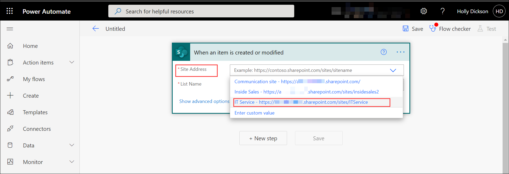
‎  
‎**Note:** If you do not see the **IT Services** site in the drop-down list, then switch to the browser tab containing the **Service Desk Request** list and copy the URL. Switch back to the browser tab running the Power Automate designer tool, select **Enter custom value,** and then past the URL for the **Service Desk Request** list. However, notice how Power Automate trims the URL so that it is only the site address and does not include the name of the list. You will need to do the same here.

12. In the **List Name** field, select the **drop-down arrow**, and in the list that appears select **Service Desk Requests**. 

    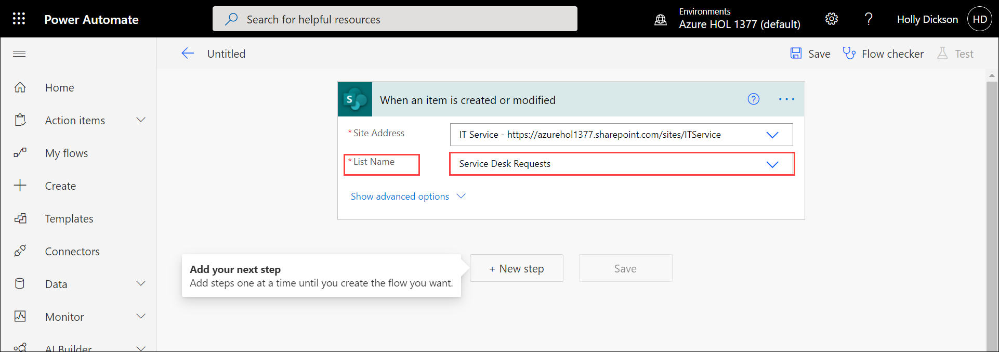

13. Select **Show advanced options.**

     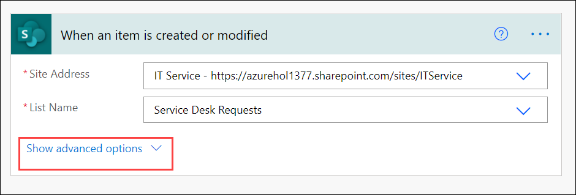

14. In the **Limit Columns by View** field, select the **drop-down arrow**, and in the list that appears select **Enter custom value**. Then in the **Limit Columns by View** field, enter **Active cases by Support Agent**.

     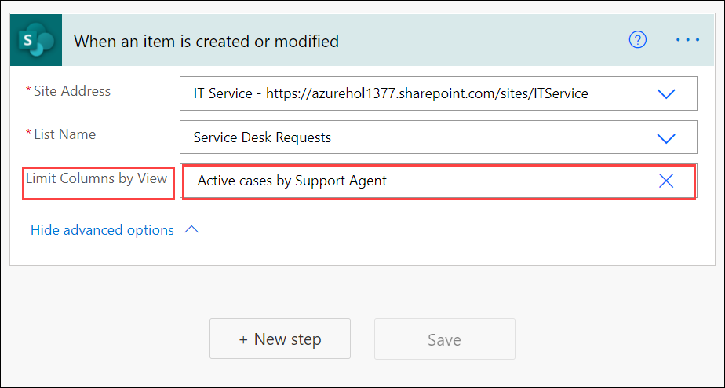
‎  
‎**Note:** The purpose of this field is to help avoid column threshold issues. The **All Items** view, which is the default view for this SharePoint list, displays all the available columns. On the other hand, the **Active Cases by Support Agent** view uses only a partial set of columns. 

15. Select the **+ New step** button.

    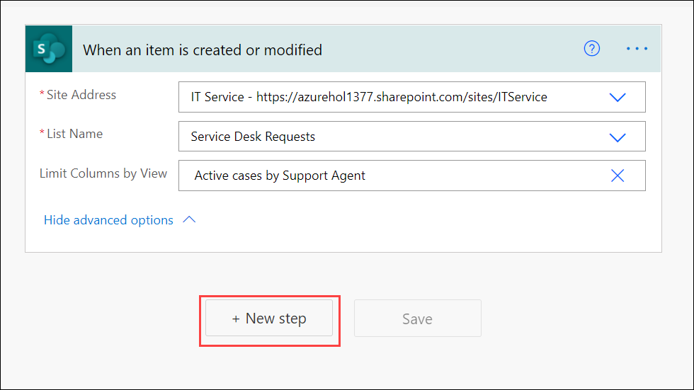

16. The next screen in the Power Automate designer tool requires that you choose an action to be performed when an item is created or modified. Holly wants to send an email to ODL Administrator.   
‎  
‎In the **Search connectors and actions** field at the top of the screen (below **Choose an action**), type in **Outlook**. Under the **All** tab that appears below this Search field, select **Office 365 Outlook**. This will display a list of all the actions available for the Office 365 Outlook connector.

    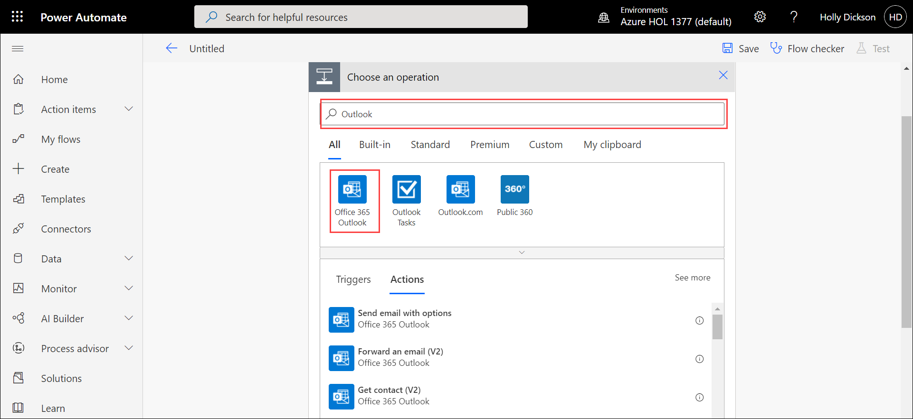

17. From the list of actions, scroll down and select **Send an email (V2).**

    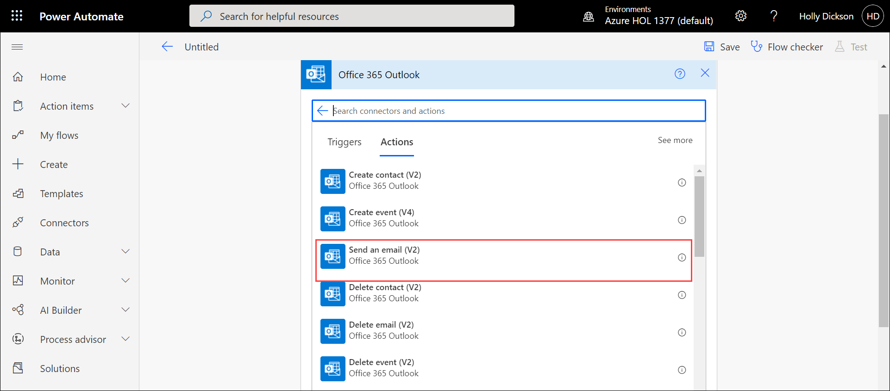

18. This opens an email form. Since Holly wants to send an email to ODL Administrator, enter the following information in this email:

	- **To** - enter **ODL** in the field. A list of user accounts starting with ODL will appear. This list should include two ODL Administrator accounts – one for ODL Administrator, and one for the IT Consultant’s ODL Administrator. Select **ODL_USER_ID@xxxxxZZZZZZ.onmicrosoft.com**, whose tenant suffix ID was provided to you by your lab hosting provider. Do **NOT** select the account whose tenant suffix ID is your fellow student’s tenant ID that was assigned to you by your instructor. 
	
**Note:** There is hypertext located at the bottom right of the flow tray that reads **Add dynamic content**. You can use this to input data directly from the ticket item
		
**Note:** If nothing appears in **Add dynamic content** or while you type in **ODL** in **To** field of email, repeat steps from step-7 to step-18
	
- **Subject** – Select inside the **Subject** field; this will display a list of parameters that you can choose from to display in the **Subject** line of the email. This list includes various connectors as well as each field from the **Active Cases** view that you selected earlier. Scroll down in the list and select **Issue Title.** Note that when you make this selection, **Issue Title** appears in the **Subject** field. The subject line of the email will be the actual **Issue Title** for the item that was added or edited in the SharePoint list.   
‎  
‎**Note:** You can add additional parameters to the subject line; however, for this lab you will only select the **Issue Title**.  
‎  
‎While Holly only wants to display the **Issue Title** in the Subject line, she does want to add additional text to the subject line of the email. In the **Subject** field, place the cursor in front of the SharePoint parameter **Issue Title** (click on the left hand edge of the SharePoint icon to see a cursor marker appear in the field; if you select in the blank space in front of the SharePoint icon, it will not insert the cursor marker) and enter **New or edited Service Request:** (leave a space after the colon).

- **Body –** Below the menu bar in the **Body** field is the message area that displays the following message: **Specify the body of the email.** Select this message, which displays a list of available SharePoint parameters. You can create the body of the email by adding one or more of these parameters along with text that you enter.   
‎  
‎Feel free to enter anything that you wish, but here is an example that you could enter that includes text and two parameters from the list (the value of the **Customer** and **Assign To** fields in the ticket that was added or edited):  
‎  
‎**A service request ticket submitted by &lt;Customer DisplayName&gt; and assigned to &lt;Assign To DisplayName&gt; was added or edited.**   
‎  
‎**Note:** If you use this example, make sure you add a space before and after the selected parameters (**Customer DisplayName** and **Assign To DisplayName).**

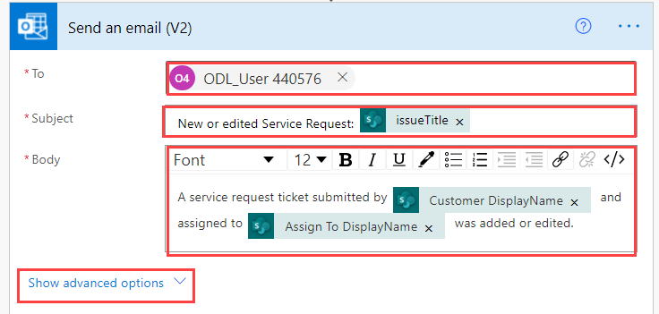

19. At the bottom of the email form, select **Show advanced options**. Scroll to the bottom of the list, select the **Importance** field, and in the list that appears, select **Normal**.

    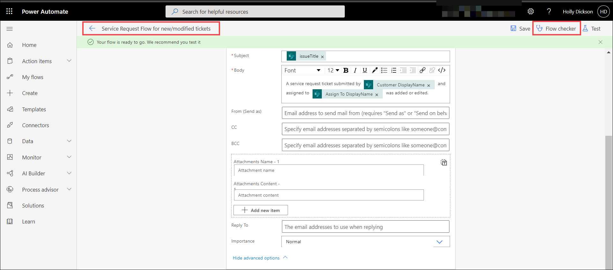

20. At the bottom of the page, select **Save**. Scroll up to the top of the screen, where in the top-left corner, it displays the name that Power Automate assigned to this flow: **When an item is created or modified -&gt; Send an email (V2)**.   
‎  
‎Holly wants to change this to a more user-friendly name. To rename the flow, select this flow name, which highlights the name. Enter **Service Request flow for new/modified tickets** and then select anywhere below the name.

   

21. At the top right corner of the screen (on the same row as the flow name), select **Flow checker**. In the **Flow checker** pane that appears, there should be zero errors and zero warnings.   
‎  
‎**Note:** If an error or warning occurs, select the drop-down arrow to the left of the Error or Warning line to display the specific issues.   
‎  
‎Select the **X** in the top right corner of the **Flow Checker** pane to close it. 

   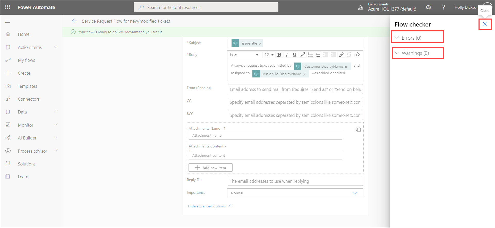

22. At the top right corner of the screen, select **Test.** On the **Test Flow** pane that appears, select the **Manually** option, and then select **Save &amp; Test**. Leave this browser tab open.  

   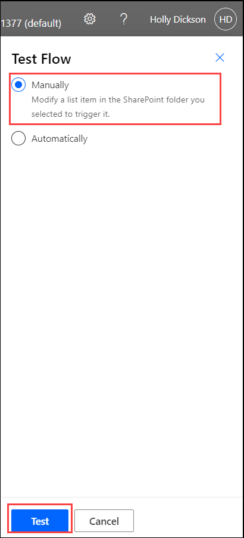
‎  
‎**Note:** If at any time you accidentally close this tab or navigate away from this page, select **My flows** in the left-hand navigation pane, select this flow from the list of flows, and then in the menu bar that appears at the top of the page for this flow, select **Edit**. That will return you to this window where you can run the **Flow Checker** and run a **Test**. 

23. In your browser, select the **IT Services - Service Desk Requests – All Items** tab. 

24. In the **Service Desk Requests** list, create a new ticket with the following information:

	- Issue Status – **Active**

	- Date – **enter the current month**

	- Issue Title – **Power Automate Flow test**

	- Description – **Testing the flow**

	- Customer – enter **Megan**, then select **Megan Brown** from the list

	- Assign To – enter **Allan**, then select **Allan Deyoung** from the list  

    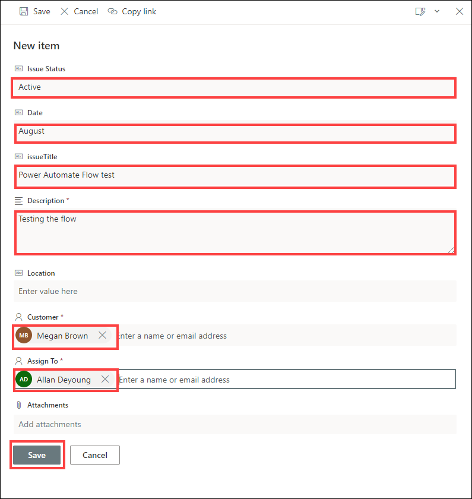

**Note:** Alternatively, you could open the Power App that you created in the earlier exercise and create an entry to the Service Desk Requests SharePoint list. You could open a new browser tab and enter the following URL to access the app in Power Apps studio: **https://make.powerapps.com**
	

	
25. After you create the entry on the SharePoint list, switch back to the browser tab containing the flow (the tab name will have changed to **Run History | Power Automate**). 

26. On the top of the screen, you should hopefully see a message indicating **Your flow ran successfully**, and next to each step in the flow you will see **green check marks**. Keep this tab open. 

    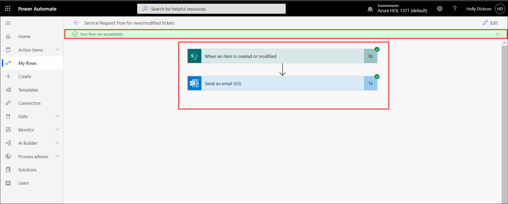
    
27. To verify whether the flow sent an email to the **ODL_USER_ID@xxxxxZZZZZZ.onmicrosoft.com**, you should check the user’s Inbox in Outlook to see whether an email was received.

	Switch to **VM-Deployment-ID**.

28. On **VM-Deployment-ID**, in your Edge browser, you should be logged in as Holly Dickson. Select Holly’s user icon in the upper right corner of the screen, and in the **My account** pane, select **Sign out.** 

	Close Edge and all the open tabs to clear your cache, then select the **Edge** icon on the taskbar to start a new browser session.

29. In your Edge browser, enter the following URL in the address bar: **https://portal.office.com**

30. In the **Pick an account** window, select the **ADATUM\Azureuser Administrator** account for your tenant. Verify the username is **ODL_USER_ID@xxxxxZZZZZZ.onmicrosoft.com** (where xxxxxZZZZZZ is the tenant prefix provided by your lab hosting provider).

31. In the **Enter password** window, enter the tenant password provided by your lab hosting provider and select **Sign in**.

32. On the **Office 365 Home** page, select the **Outlook** icon from the column of app icons on the left side of the screen. This will open the **Inbox** for the **ODL Administrator**. If a **Welcome** window appears, then close it now.

33. The **Inbox** should include an email from **Holly Dickson** with a subject line that starts with: **New or edited Service Request**. Select this email to open it.   

    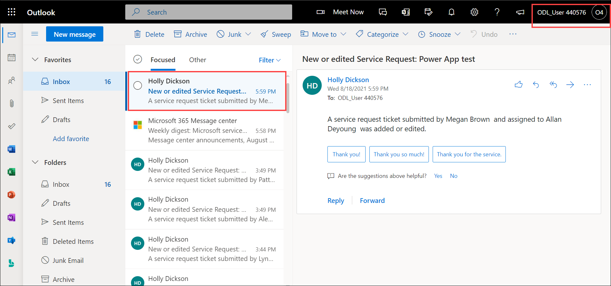
    
	**Note:** It may take a few minutes for the email to show up in the ODL Administrator’s inbox. If need be, skip to step 36 and check back on the email at the end of this task.

34. After opening the email, verify the full subject line is: **New or edited Service Request: &lt;Issue Title from the record that you created&gt;**. Also verify that the body of the email message is correct, and that if you included any parameters in the message (such as the Customer and Assign To values), that they are correct as well.

    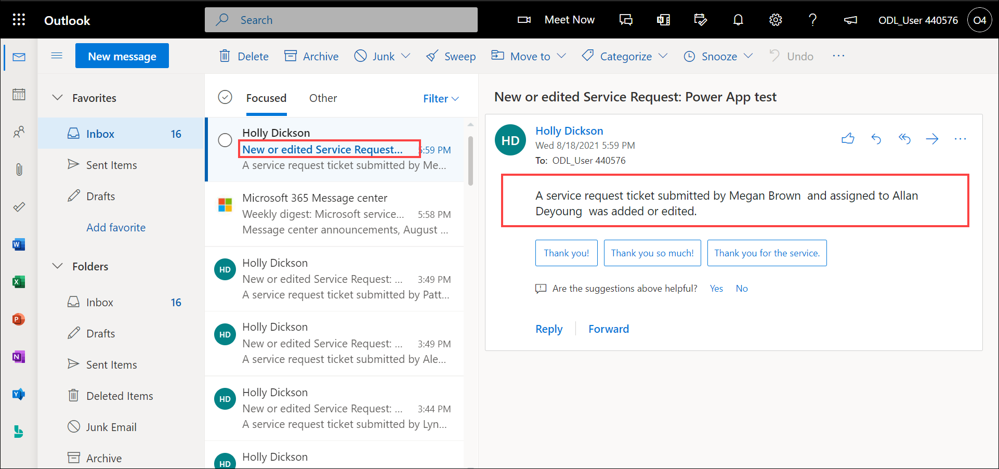

35. Switch back to **VM-Deployment-ID**.

36. On **VM-Deployment-ID**, select the **Run History | Power Automate** tab in your browser (if necessary). 

37. In **Power Automate studio**, in the left-hand navigation pane, select **My flows**. 

    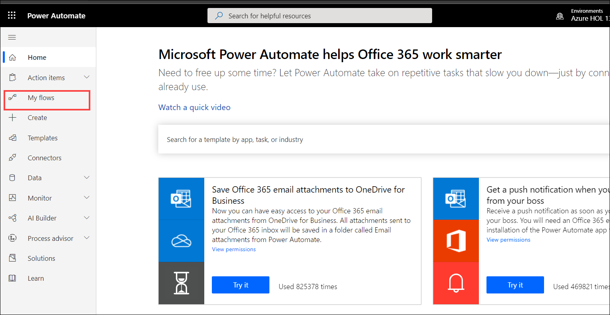

38. In the **Flows** window, select the flow that you just created from the list of your flows. 

    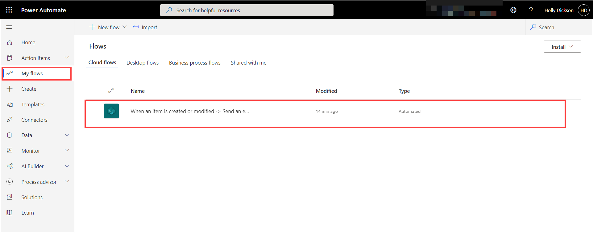
39. Review the information in the window for this flow. Scroll down to the bottom of the window and in the **Runs** group, you will see each of the times this flow ran. You should see the run that occurred for the record that you just created in the **Service Desk Requests** list. The status of the run should be **Succeeded**, which indicates the email was sent to the ODL Administrator. 

    
    
‎  
‎In addition, review the menu options that appear in the menu bar at the top of the page. You will not make any changes, but for future reference, you would select **Edit** if you wish to change anything in the flow. From the **Edit** form, you can run **Flow Checker** and **Test,** just as you did earlier when you first created the flow. 

40. Leave all the tabs open in your browser for the next task.

**Congratulations! You have successfully created an automated flow in Power Automate that adds another level of communication in ADATUM\Azureuser Administrator’s Service Request Ticketing system.**

### Task 2 – Assign an additional owner to the flow

In this task you will add an additional owner to the Power Automate flow that you just created. Generally, it is a good practice to designate additional owners to a flow, just as you would for a SharePoint site. This ensures that any issue can be addressed, and the flow can continue to run if the primary owner has changed roles or left the company. For the flow that Holly just created for her pilot project, she wants to add Allan Deyoung as an additional owner.

1. After having completed the prior task in which you created a flow in Power Automate, you should still be logged into VM-Deployment-ID as **ADATUM\Azureuser Administrator** and a password of **Pa55w.rd**; if not, then do so now.

2. You should still have the browser tab open to the **Flows &gt; Service Request Flow for new/modified tickets** window. If not, then repeat the steps you performed in the prior task to get to this tab (from **Power Automate studio**, select **My flows**, then select the flow you just created).

3. On the menu bar, select **Share**.

   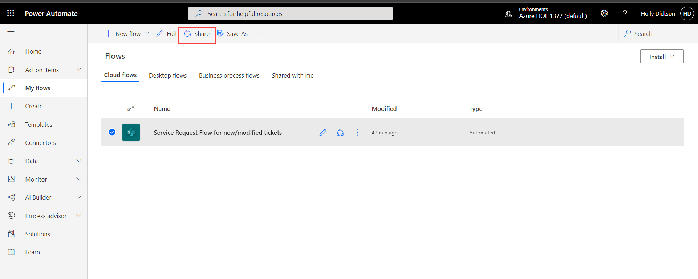

4. In the **Owners** section, in the **Add a user or group as owner** field, enter **Allan**. In the user list that appears, select **Allan Deyoung**. 

   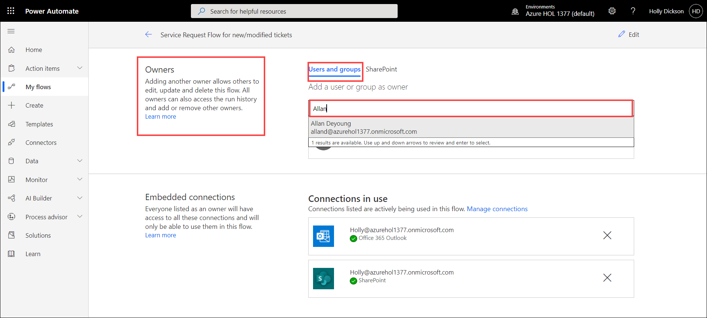

5. In the **Connections Used** window that appears, read the information and then select **OK.** Note that Allan (or anyone you add as an owner) will have full access to all connections in the flow and the content within the connected accounts. 

   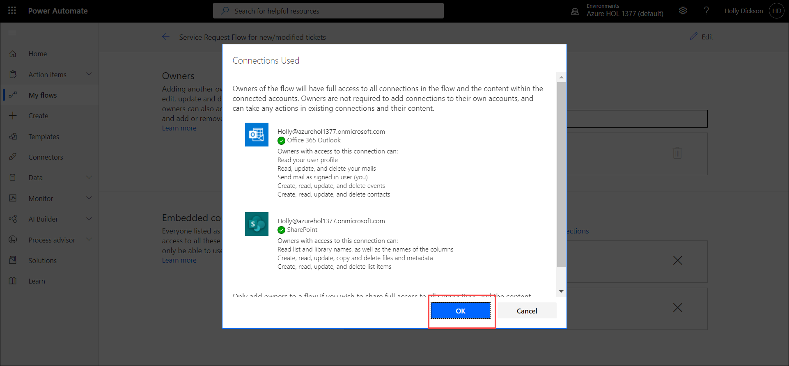

6. This will return you to the **Share** screen for the flow, and it will display Allan and Holly as owners of the flow. Select the **left arrow** that appears next the flow name at the top of the screen; this will return you to the detail screen for this flow.   

   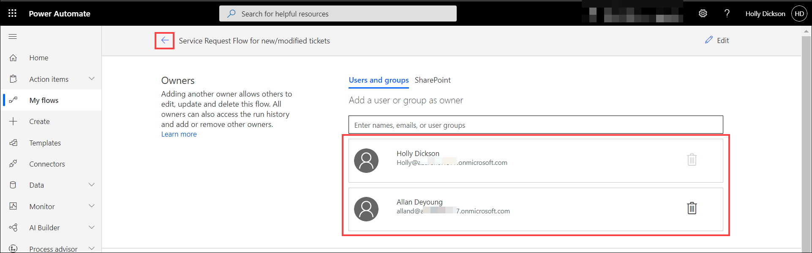
   
‎  
‎**Note:** On the details screen, Holly will appear as the lone owner on the left-hand side of the screen, below the flow name. This owner represents the original owner of the flow. However, in the Owners section on the bottom right side of the screen, you will see both Holly and Allan as owners of the flow.

7. On the left-hand navigation pane, select **My flows**. 

8. In the **Flows** window, notice that the **Cloud flows** tab is selected by default. Also notice the message that appears in the middle of the screen indicating **You don’t have any flows**. Do not worry! Since you have shared ownership of the flow with another user or group, the flow is now considered a shared flow. 

   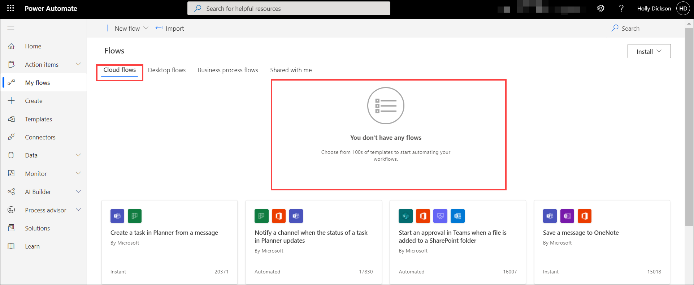
   
9. In the **Flows** window, select the **Shared with me** tab.

   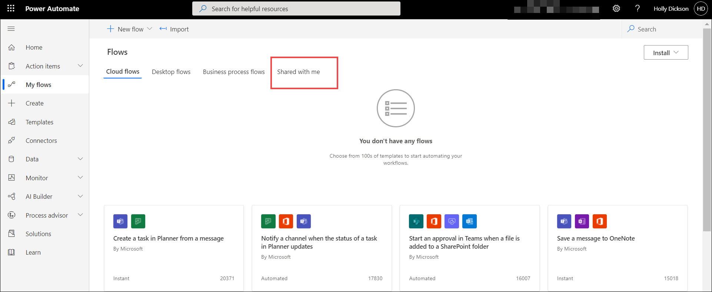

10. In the **Shared with me** tab, hover your mouse over the name of the flow and select the **vertical ellipses (More commands)** icon that appears to the right of the flow name. In the menu that appears, review the options that are available. Select the **Esc** button on your keyboard to close the menu (or select anywhere on the screen).

   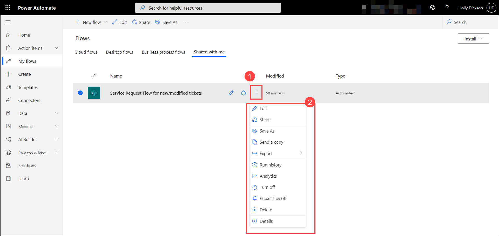

11. Leave all the tabs open in your browser for the next task.

 
# Proceed to Lab 3 - Exercise 9

