# Learning Path 5 - Lab 4 - Exercise 2 - Implement Identity Synchronization 

In this exercise, you will enable synchronization between Adatum’s on-premises Active Directory and Azure Active Directory. Azure AD Connect will then continue to synchronize any delta changes every 30 minutes. You will then make some user and group updates and then manually force an immediate synchronization rather than waiting for Azure AD Connect to automatically synchronize the updates. You will then verify whether the updates were synchronized.  

‎**Important:** When you start this exercise, you should perform the first four tasks without any delay between them so that Azure AD Connect does not automatically synchronize the changes that you make to the identity objects.

### Task 1: Install Azure AD Connect and Initiate Synchronization

In this task, you will run the Azure AD Connect setup wizard to enable synchronization between Adatum’s on-premises Active Directory and Azure Active Directory. Once the configuration is complete, the synchronization process will automatically start. 

1. You should still be logged into **LON-DC1-ID** as the **Azureuser Administrator** from the prior task. 

1. After finishing the previous lab exercise, you should still be logged into Microsoft 365 in your Edge browser as Holly Dickson.  

1. In your **Edge** browser, select the **Microsoft 365 admin center** tab, and then in the left-hand navigation pane, select **Users**, and then select **Active Users**.  

	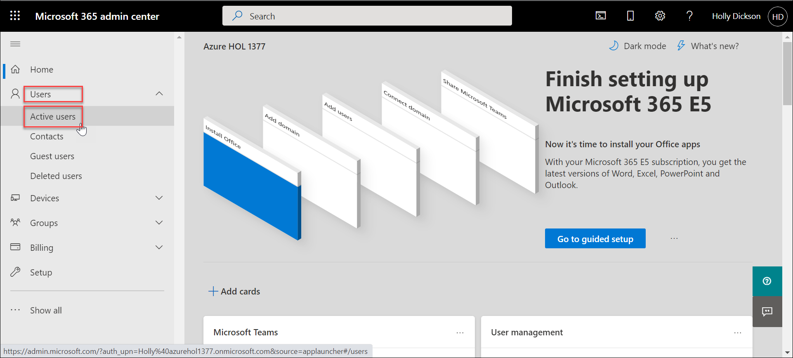

1. In the **Active users** window, on the menu bar, select the **ellipsis** icon (to the right of **Add multiple users**), and then in the drop-down menu, select **Directory synchronization**. 

	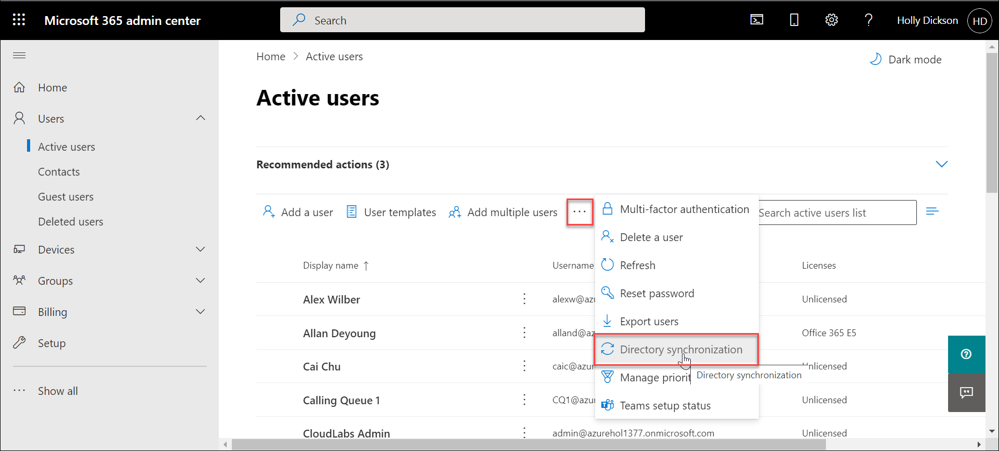

1. In the **Azure Active Directory preparation** window, select **Go to the Download center to get the Azure AD Connect tool**. This opens a new tab in your browser and takes you to the Microsoft Download Center.

	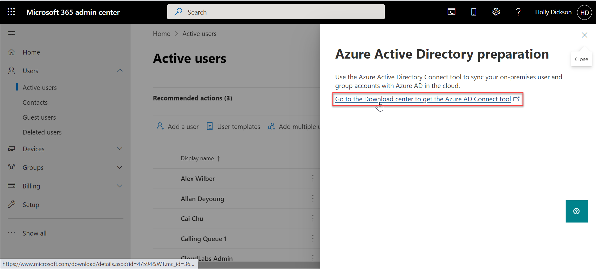

1. In the **Microsoft Download Center**, scroll down to the **Microsoft Azure Active Directory Connect** section and select **Download**. 

	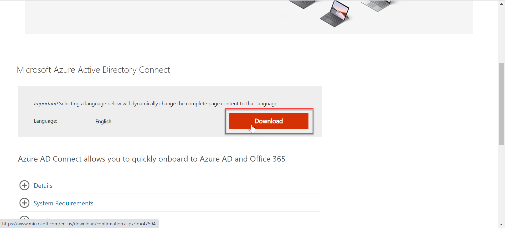

1. In the notification bar at the bottom of the screen, once the **AzureADConnect.msi** file has finished downloading, select **Open file**.

	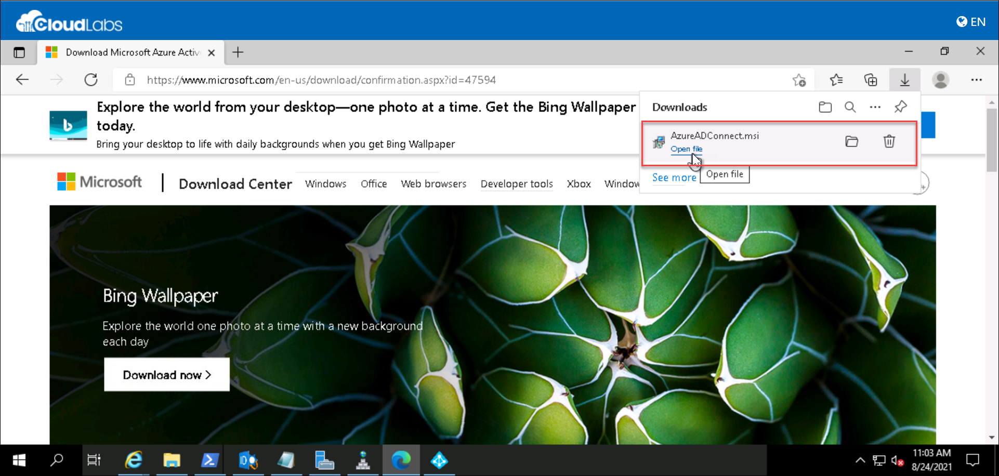

1. This initiates the installation of the Microsoft Azure Active Directory Connect Tool. 

	If a **Do you want to run this file?** dialog box appears, select **Run**.

	If the **Welcome to Azure AD Connect** window does not appear on the desktop, find the icon for it on the taskbar (it will be the final icon on the right) and select it.
	
1. When you run the setup, you may get an error message if you don’t have the TLS enabled, if not ignore this step 9 and 10.

	

1. If Windows PowerShell ISE is still open, then select the PowerShell icon on your taskbar; otherwise, you must open Windows PowerShell ISE by selecting the **magnifying glass (Search)** icon on the taskbar, typing powershell in the Search box that appears, right-clicking on **Windows PowerShell ISE**, and selecting Run as administrator in the drop-down menu. open select **file** and click on **new**, Run the following PowerShell commands to enable TLS 1.2.
	
		New-Item 'HKLM:\SOFTWARE\WOW6432Node\Microsoft\.NETFramework\v4.0.30319' -Force | Out-Null

		New-ItemProperty -path 'HKLM:\SOFTWARE\WOW6432Node\Microsoft\.NETFramework\v4.0.30319' -name 'SystemDefaultTlsVersions' -value '1' -PropertyType 'DWord' -Force | Out-Null

		New-ItemProperty -path 'HKLM:\SOFTWARE\WOW6432Node\Microsoft\.NETFramework\v4.0.30319' -name 'SchUseStrongCrypto' -value '1' -PropertyType 'DWord' -Force | Out-Null

		New-Item 'HKLM:\SOFTWARE\Microsoft\.NETFramework\v4.0.30319' -Force | Out-Null

		New-ItemProperty -path 'HKLM:\SOFTWARE\Microsoft\.NETFramework\v4.0.30319' -name 'SystemDefaultTlsVersions' -value '1' -PropertyType 'DWord' -Force | Out-Null

		New-ItemProperty -path 'HKLM:\SOFTWARE\Microsoft\.NETFramework\v4.0.30319' -name 'SchUseStrongCrypto' -value '1' -PropertyType 'DWord' -Force | Out-Null

		New-Item 'HKLM:\SYSTEM\CurrentControlSet\Control\SecurityProviders\SCHANNEL\Protocols\TLS 1.2\Server' -Force | Out-Null
	
		New-ItemProperty -path 'HKLM:\SYSTEM\CurrentControlSet\Control\SecurityProviders\SCHANNEL\Protocols\TLS 1.2\Server' -name 'Enabled' -value '1' -PropertyType 'DWord' -Force | Out-Null
	
		New-ItemProperty -path 'HKLM:\SYSTEM\CurrentControlSet\Control\SecurityProviders\SCHANNEL\Protocols\TLS 1.2\Server' -name 'DisabledByDefault' -value 0 -PropertyType 'DWord' -Force | Out-Null
	
		New-Item 'HKLM:\SYSTEM\CurrentControlSet\Control\SecurityProviders\SCHANNEL\Protocols\TLS 1.2\Client' -Force | Out-Null
	
		New-ItemProperty -path 'HKLM:\SYSTEM\CurrentControlSet\Control\SecurityProviders\SCHANNEL\Protocols\TLS 1.2\Client' -name 'Enabled' -value '1' -PropertyType 'DWord' -Force | Out-Null
	
		New-ItemProperty -path 'HKLM:\SYSTEM\CurrentControlSet\Control\SecurityProviders\SCHANNEL\Protocols\TLS 1.2\Client' -name 'DisabledByDefault' -value 0 -PropertyType 'DWord' -Force | Out-Null
		Write-Host 'TLS 1.2 has been enabled.'
		

1. Open the **Azure AD connect**, On the **Welcome to Azure AD Connect** window in the setup wizard, select the **I agree to the license terms and privacy notice** check box and then select **Continue**.

	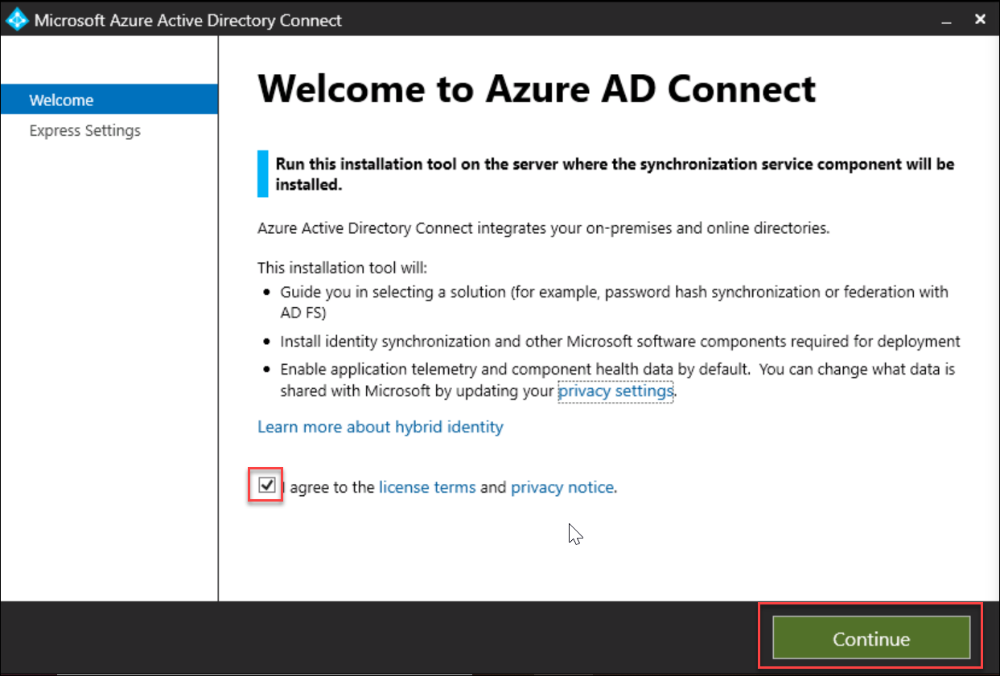

1. On the **Express Settings** page, read the instruction regarding a single Windows Server AD forest and then select **Use express settings**.

	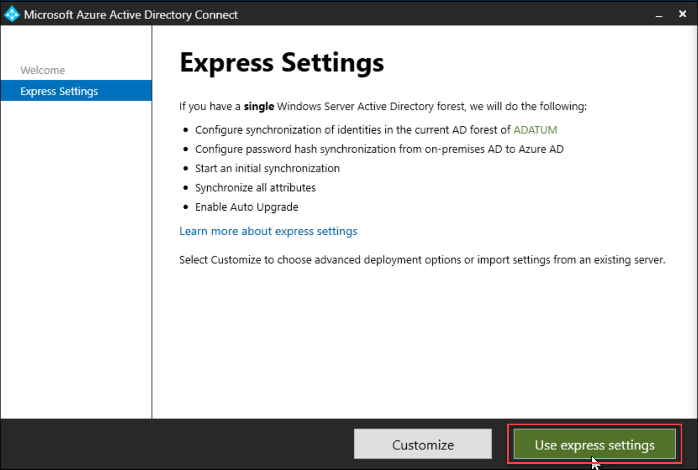

1. On the **Connect to Azure AD** window, enter **Holly@xxxxxZZZZZZ.onmicrosoft.com** (where xxxxxZZZZZZ is the tenant prefix provided by your lab hosting provider) in the **USERNAME** field, enter **Pa55w.rd** in the **PASSWORD** field, and then select **Next** (if the **Next** button is not enabled, then tab off the PASSWORD field to enable it). 

	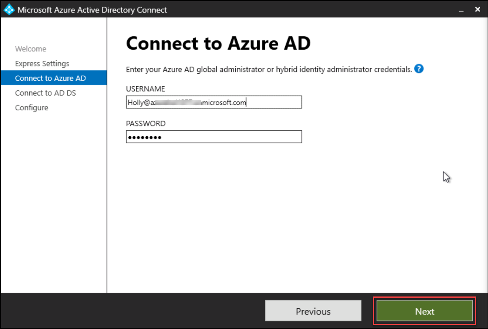

1. On the **Connect to AD DS** page, enter **adatum\Azureuser Administrator** in the **USERNAME** field, enter the Password provided in the environment details, and then select **Next**  (if the **Next** button is not enabled, then tab off the PASSWORD field to enable it). 

	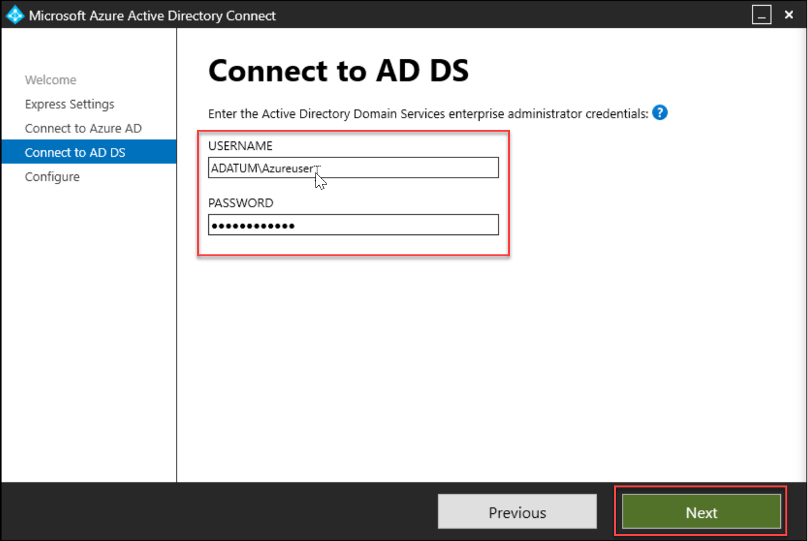

1. In the **Azure AD sign-in configuration** window, select the **Continue without matching all UPN suffixes to verified domains** check box at the bottom of the page and then select **Next**.

	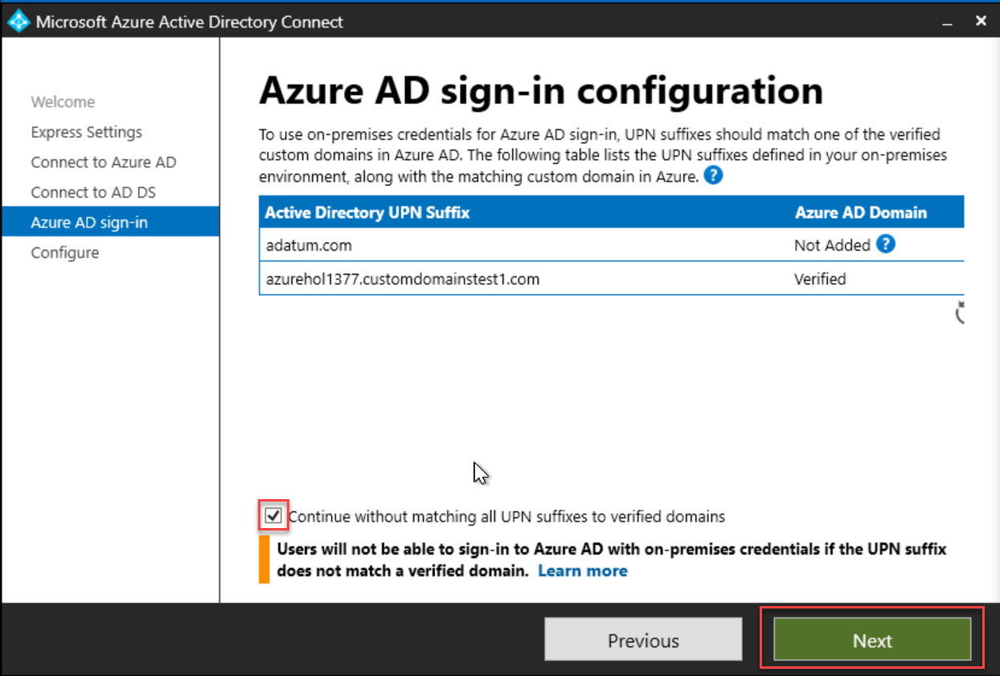

1. On the **Ready to configure** screen, select the check box for **Start the synchronization process when configuration completes** if it’s not already selected, and then select **Install**.

	

1. Wait for the configuration to complete (which may take several minutes) and then select **Exit**. 

	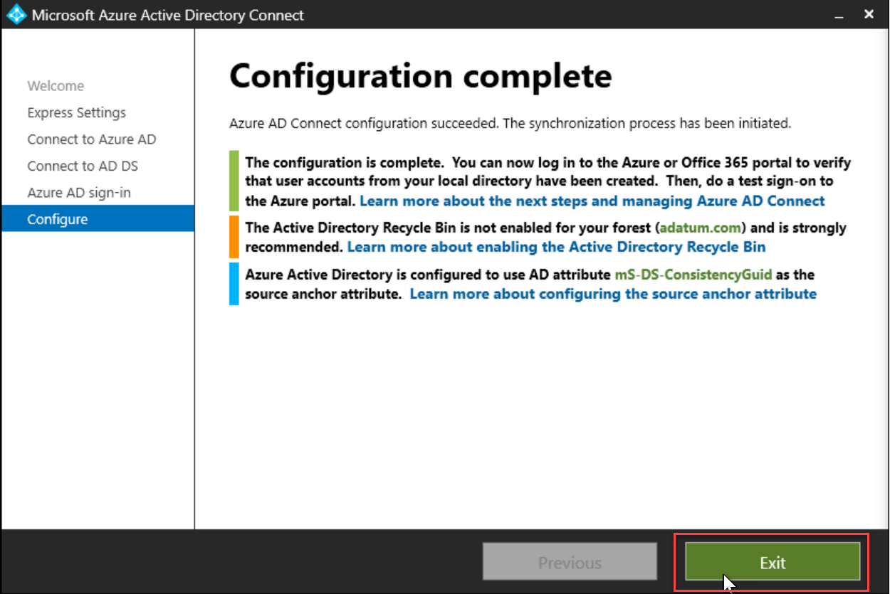

1. Select the **Windows (Start)** icon in the lower left corner of the taskbar. In the **Start** menu that appears, select **Azure AD Connect** to expand the group, and then select **Synchronization Service** to start this desktop application.  

	**Note:** If you selected **Azure AD Connect** in the **Start** menu and it expanded and you were able to select **Synchronization Service**, then proceed to the next step. However, if **Azure AD Connect** did not expand when you selected it in the **Start** menu, then you will need to close all applications and then restart LON-DC1. The remaining instruction in this step is what to do if you needed to restart LON-DC1.  

	After LON-DC1 restarts, Log in with the username and password as provided in the environment details. Minimize **Server Manager** after it opens, and then open **Edge** and navigate to **htps://portal.office.com**. Log in as **Holly@xxxxxZZZZZZ.onmicrosoft.com** with a Password of **Pa55w.rd**. On the **Microsoft Office Home** page, select **Admin** to open the **Microsoft 365 admin center**.  

	Then select the **Windows (Start)** icon in the lower left corner of the taskbar. In the **Start** menu that appears, select **Azure AD Connect** to expand the group (this time it should expand), and then select **Synchronization Service**.  

	

1. Maximize the **Synchronization Service Manager on LON-DC1** window. The **Operations** tab at the top of the screen is displayed by default so that you can monitor the synchronization process, which automatically started when you selected this program. 

	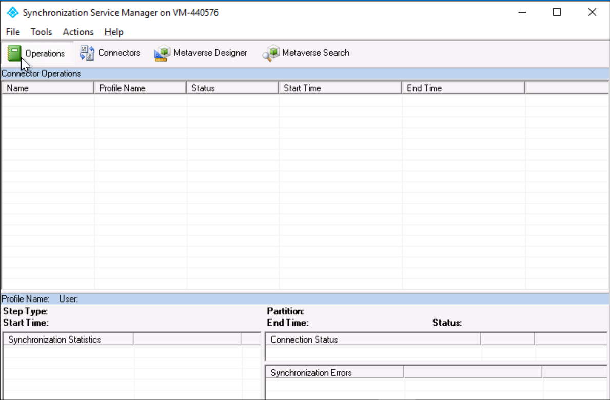	

1. Wait for the **Export** profile to complete for **xxxxxZZZZZZ.onmicrosoft.com**; when it finishes, its **Status** should be **completed-export-errors**. Once it's complete and you see this status, select this row.  

19. In the bottom portion of the screen, a detail pane appears showing the detailed information for this operation. 

	- In the **Export Statistics** pane on the left, note the number of users that were added and the number that were updated. 
	- In the **Export Errors** pane on the right, note the errors that appear. If you recall back in the prior lab exercise when you ran the IdFix tool, there were two users with validation errors that you purposely did not fix (**Ngoc Bich Tran** and **An Dung Dao**). Select the links (CN={xxxxxx...) under the **Export Errors** column that apply to the two **Data Validation** errors; this will display these two users that were not synchronized by the Azure AD Connect tool due to these errors. Review the errors to see why these two accounts are broke.    

	‎**Note:** Because a synchronization had not been performed prior to this, the initial synchronization was a **Full Synchronization** (see the **Profile Name** column in the top pane). Because the synchronization process will continue to run automatically every 30 minutes, any subsequent synchronizations will display **Delta Synchronization** as its **Profile Name**. If you leave the **Synchronization Service Manager** window open, after 30 minutes you will see that it attempts to synchronize the two users who were not synchronized during the initial synchronization. These will display as a **Delta Synchronization**.

20. Now that you have seen Azure AD Connect complete a Full Synchronization, in the next task you will make some updates and manually force an immediate synchronization rather than waiting for it to synchronize updates every 30 minutes. Close the **Synchronization Service Manager on LON-DC1** window. 

21. In your browser, close all tabs except for the **Microsoft Office Home** tab and the **Microsoft 365 admin center** tab. 

22. Leave LON-DC1 open as it will be used in the next exercise.

### Task 2 - Create Group Accounts to Test Synchronization  

To test the manual, forced synchronization process, you will also set up several group scenarios to verify whether the forced synchronization function is working in Azure AD Connect. You will create a new security group, and you will update the group members in an existing, built-in security group, all within Adatum’s on-premises environment. 

Each group will be assigned several members. After the forced synchronization, you will validate that you can see the new security group in Microsoft 365 and that its members were synced up from the on-premises group to the cloud group. You will also validate that you can NOT see the built-in security group in Microsoft 365, even though you added members to it in Adatum's on-premises environment. Built-in groups are predefined security groups that are located under the Builtin container in Active Directory Users and Computers. They are created automatically when you create an Active Directory domain, and you can use these groups to control access to shared resources and delegate specific domain-wide administrative roles. However, they are not synchronized to Microsoft 365, even after adding members to them within their on-premises AD group. You will validate this functionality in this task.

1. You should still be logged into **LON-DC1-ID** as the **Administrator** from the prior task. 

1. If **Server Manager** is closed, then re-open it now; otherwise, select the **Server Manager** icon on the taskbar. 

1. In **Server Manager**, select **Tools** at the top right side of the screen, and then in the drop-down menu select **Active Directory Users and Computers.**

	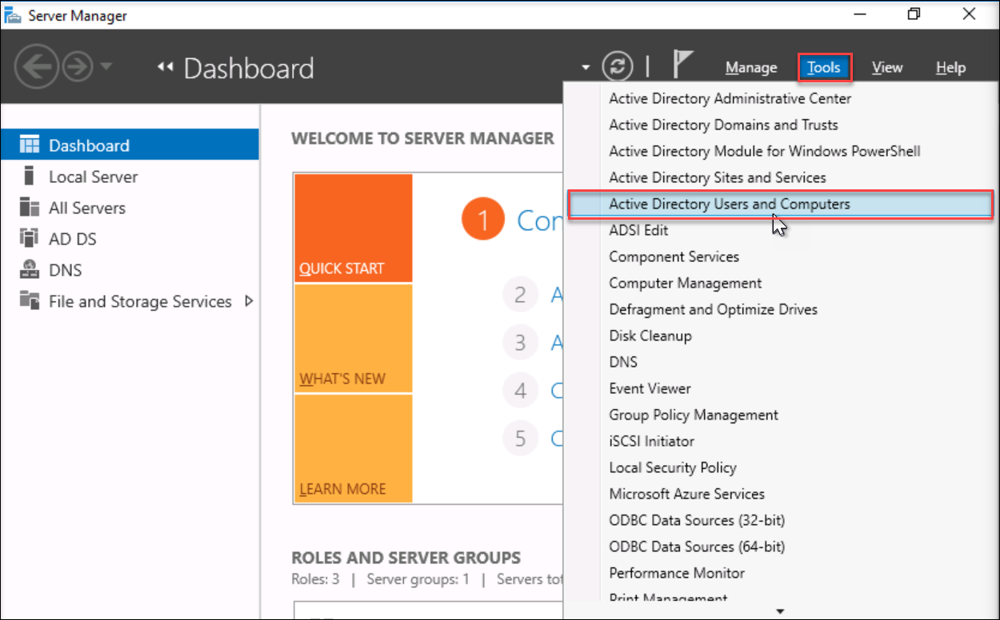

1. In the **Active Directory Users and Computers** console tree, under **Adatum.com**, select the **User** folder and Right click on the folder where you want to create the new user account, select **new** and then click **user**.

	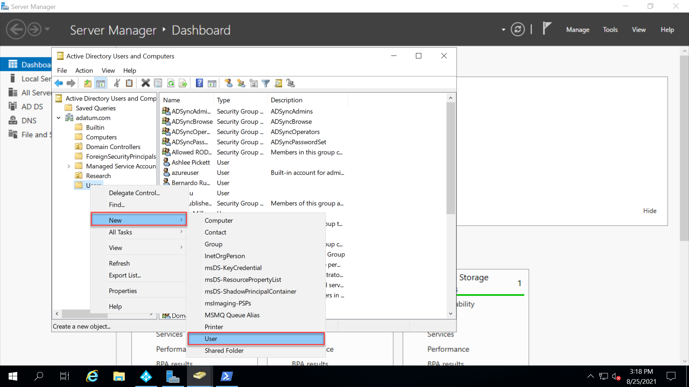

1. In the **New Object - User** window, specify the following settings, click **Next**.

   | Settings | Value |
   |--|--|
   | First name | **Ashlee** |
   | Last name | **Pickett** |
   | User logon name | **Ashleep**|
	
	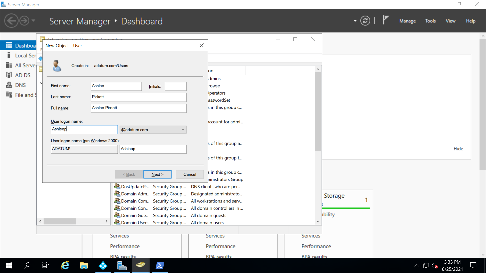

1. In the password and confirm password field, type the **Pa55w.rd**, click **next** and **finish**. 

	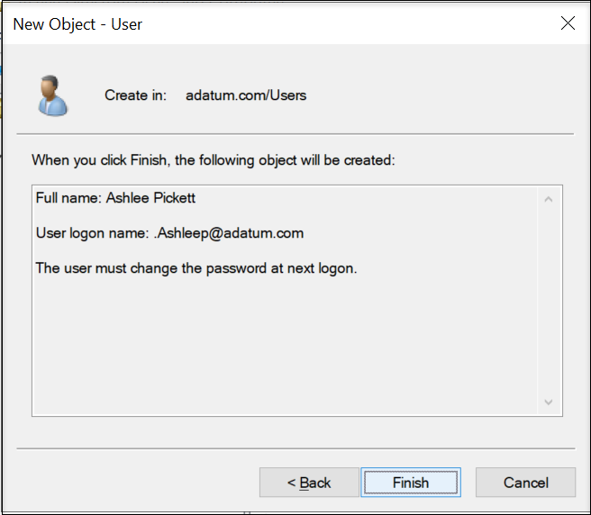
	
1. Repeat the step  from 4 to 6 for adding the following User:

	- **Juanita Cook**
 
	- **Morgan Brooks**
	
	- **Bernardo Rutter**

	- **Charlie Miller**

	- **Dawn Williamson**
	
	- **Cai Chu**  

	- **Shannon Booth**  

	- **Tia Zecirevic**  

	**Note**: Make sure you have created all the 9 users.

1. You will begin by adding members to one of the built-in security groups. In the **Active Directory Users and Computers** console tree, under **Adatum.com**, select the **Builtin** folder. This will display all the built-in security group folders that were automatically created at the time the **Adatum.com** domain was created.

	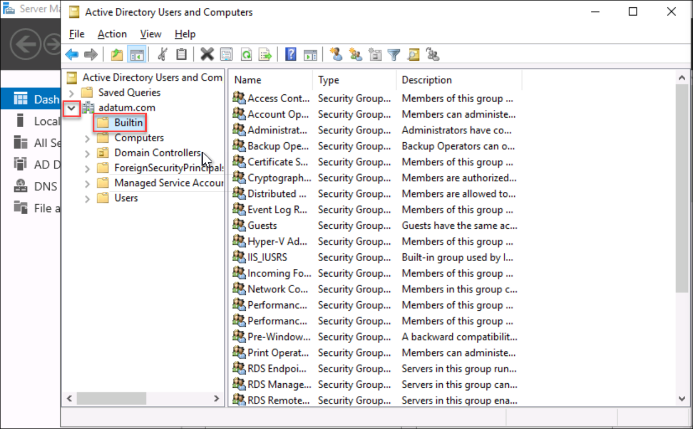

1. In the detail pane on the right, double-click the **Print Operators** security group.

	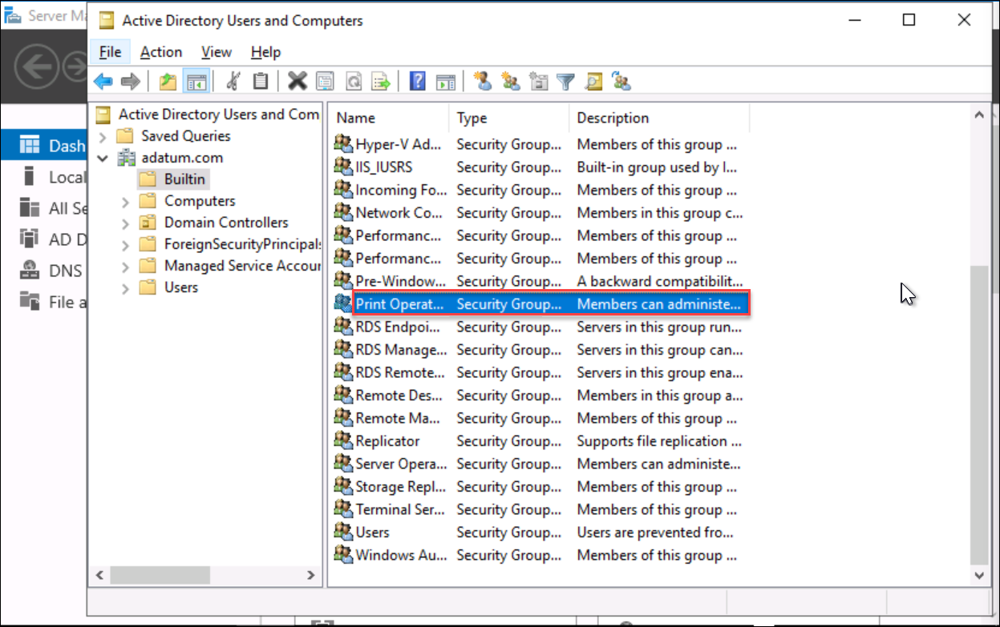

1. In the **Print Operators Properties** window, select the **Members** tab and then select the **Add** button.

	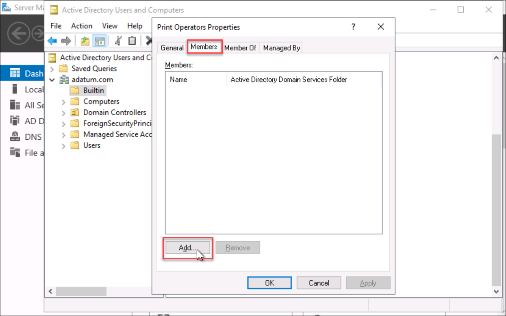

1. In the **Select Users, Contacts, Computers, Service Accounts, or Groups** window, in the **Enter the object names to select** field, type the following names (type all three at once with a semi-colon separating them):  

	- **Ashlee Pickett** 

	- **Juanita Cook** 

	- **Morgan Brooks**  

1. Select **Check Names** and once they are all validated, select **OK** to return to the **Print Operators Properties** window.
	
1. In the **Print Operators Properties** window, select **OK** to return to the **Active Directory Users and Computers** window.

	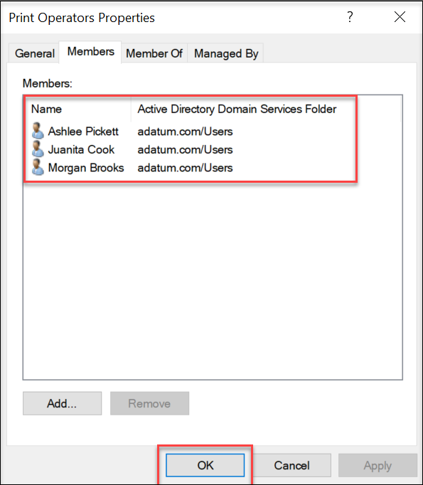

1. you will now create a new folder. right-click on the **Adatum.com**, select **New** and then select **organizational Unit**.

	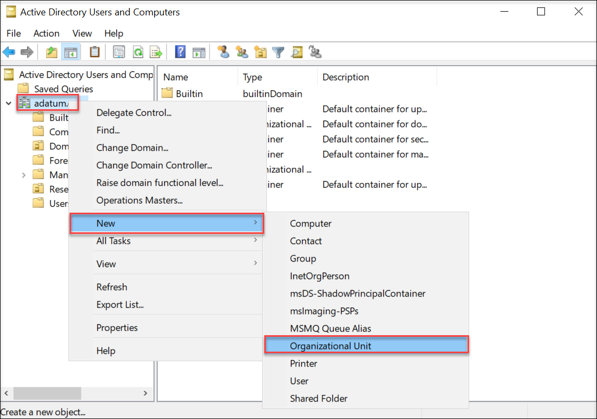

1. In the **New Object - Organizational Unit**, Enter the **Research** as a Folder name in **Name** field. click **Ok**.

	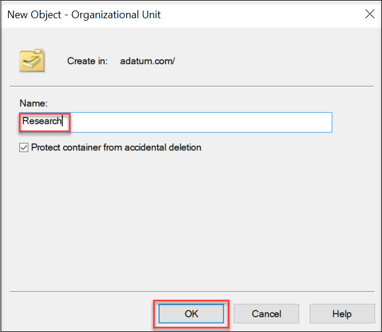
	
1. You will now create a new security group. In the console tree under **Adatum.com**, right-click on the **Research** folder, select **New,** and then select **Group**.  

	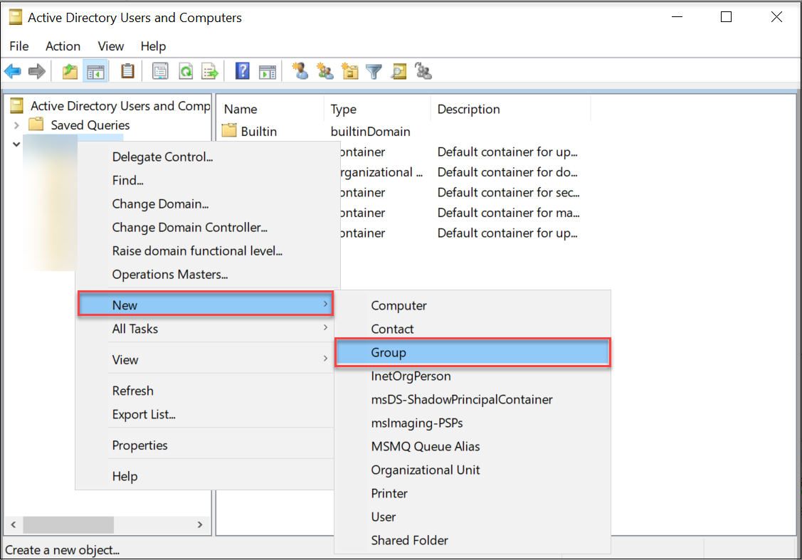

1. In the **New Object - Group** window, enter the following information:

	- Group name: **Manufacturing**

	- Group scope: **Universal**

	- Group type: **Security**

1. Select **OK**.  

	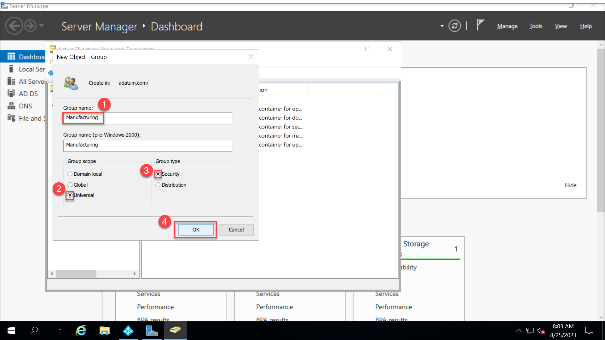
	
1. You will now create a new security group. In the console tree under **Adatum.com**, right-click on the **Research** folder, select **New,** and then select **Group**.  

	
	
1. In the **New Object - Group** window, enter the following information:

	- Group name: **Research**

	- Group scope: **Universal**

	- Group type: **Security**	

1.  Select **OK**. 

1. In the console tree under **Adatum.com**, select the **Research** folder, and then in the detail pane on the right, double-click on the **Manufacturing** security group.  

	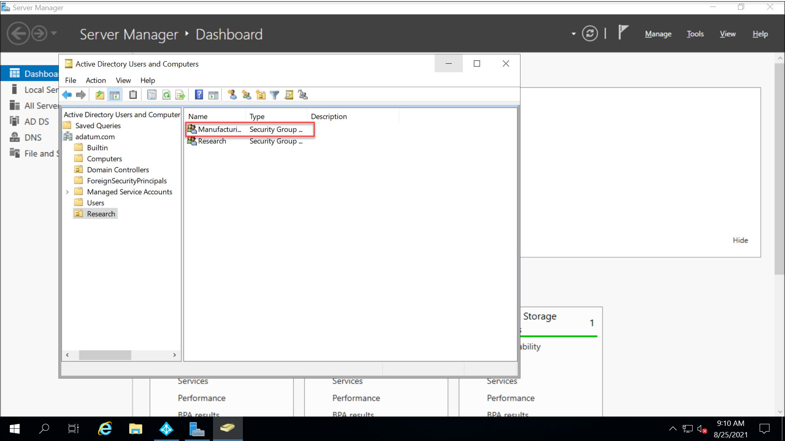

1. In the **Manufacturing Properties** window, enter **Manufacturing@adatum.com** in the **E-mail** field.  

	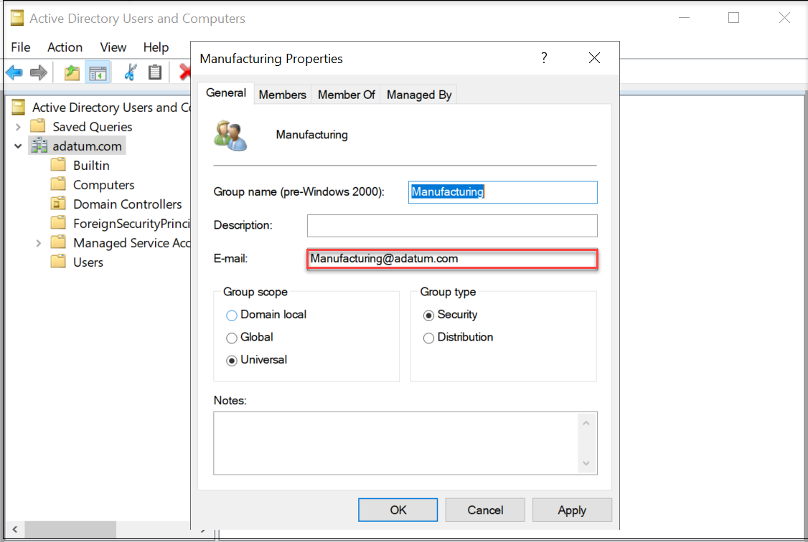

1. Select the **Members** tab, and then repeat steps 6-9 to add the following members to this group:  

	- **Bernardo Rutter**

	- **Charlie Miller**

	- **Dawn Williamson**  

	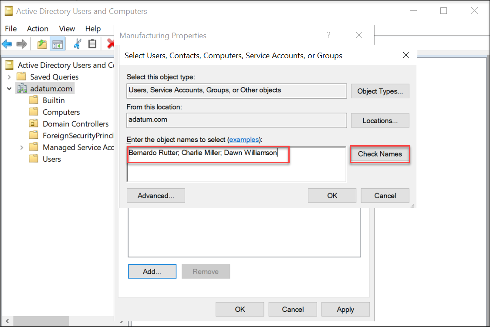
	
	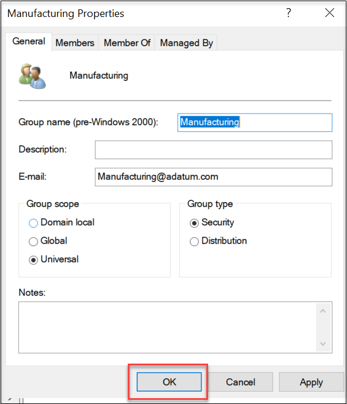

1. In the console tree under **Adatum.com**, select the **Research** folder, and then in the detail pane on the right, double-click on the **Research** security group.  

1. Select the **Members** tab, and then repeat steps 6-9 to add the following members to this group:  

	- **Cai Chu**  

	- **Shannon Booth**  

	- **Tia Zecirevic**  

1. Leave the **Active Directory Users and Computers** window open for the next task.  

 
### Task 3 - Change Group Membership to Test Synchronization  

This task sets up another scenario for testing whether the sync process is working in Azure AD Connect. In this task you will change the members of a group to see if they are reflected in the cloud once the group is synced. 

1. This task continues from where the previous task left off in LON-DC1. In the **Active Directory Users and Computers** window, in the console tree under **Adatum.com**, the **Research** organizational unit is still selected.  

	In the detail pane on the right, double-click the **Research** security group.  

	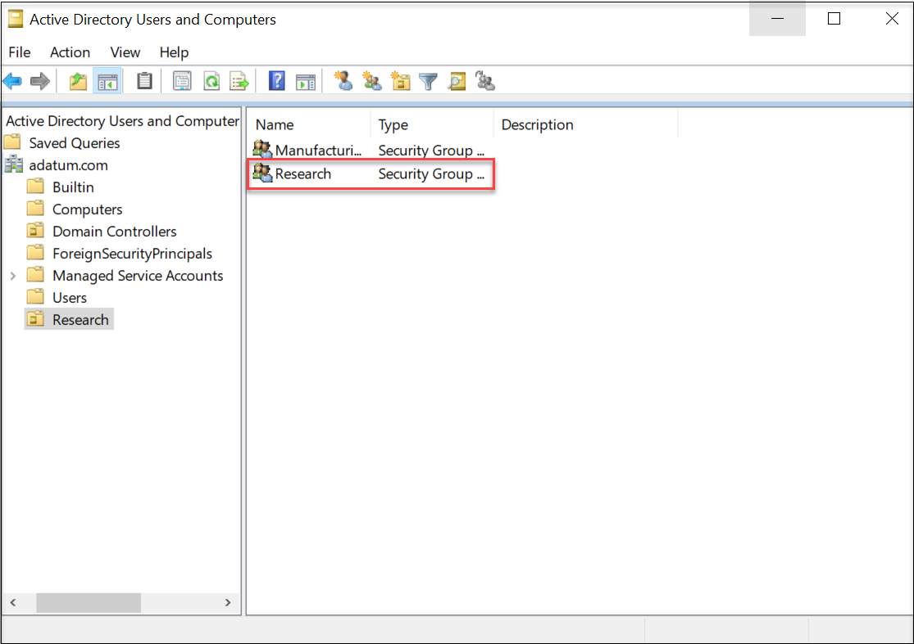

1. In the **Research Properties** window, select the **Members** tab to view the members of this group.  

	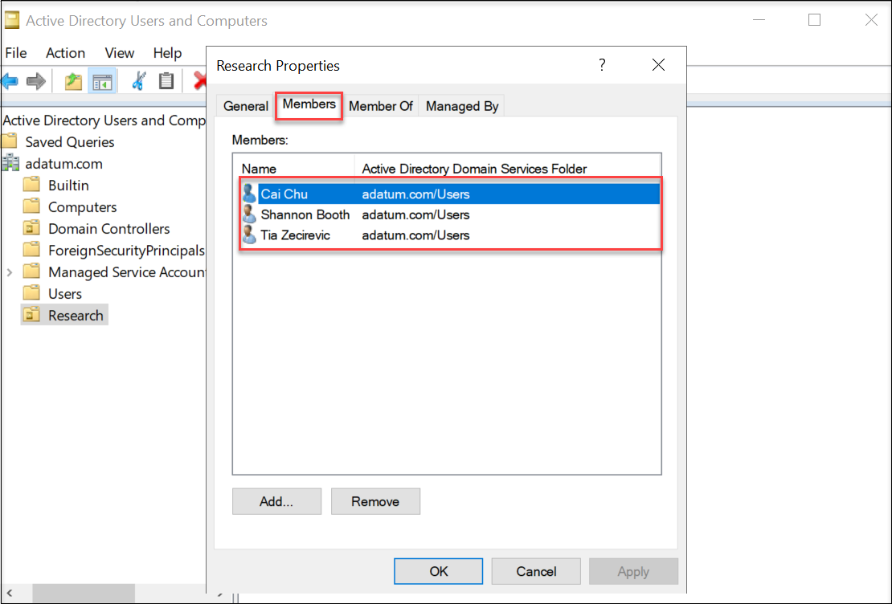

1. You want to remove the following users from the group:

	- **Cai Chu**  

	- **Shannon Booth**  

	- **Tia Zecirevic**  
	
	While you can remove each user individually, the quickest way is to remove all three at one time. Select the first user, then hold the **Ctrl** key down while selecting the other two. With all three users selected, select the **Remove** button and then select **Yes** to confirm the removal. Verify the three users have been removed, and then select **OK.**

	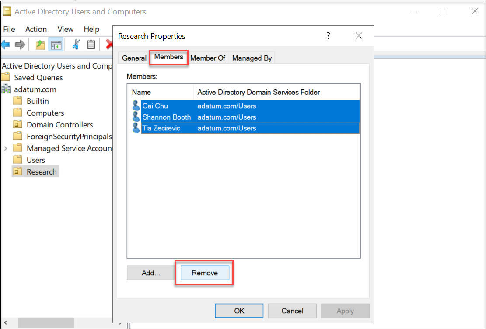
	
	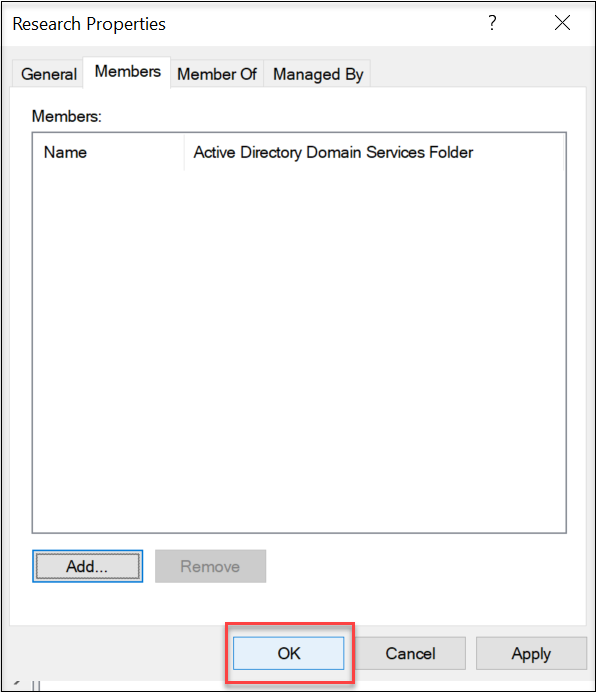

1. Close the **Active Directory Users and Computers** window.
  
1. Leave LON-DC1-ID open as you will continue using it in the next task.  

	‎**Important:** You should perform the next task immediately after completing this one so that Azure AD Connect doesn’t automatically synchronize the changes that you just made to the identity objects in the previous tasks.

### Task 4 - Force a manual synchronization   

In this task, you will force a sync between Adatum’s on-premises AD and Azure AD instead of waiting 30 minutes for Azure AD Connect to synchronize the identity objects. You must use PowerShell to perform a forced synchronization.

1. On LON-DC1-ID, if the **Windows PowerShell** application is still open from the prior exercise, then **you MUST close it now**.   

	‎**Important:** The reason for this step is that if Windows PowerShell was opened BEFORE the Azure AD Connect setup, the cmdlet **Start-ADSyncSyncCycle** that is used in step 3 will not be available and you will receive an error indicating that the cmdlet is not recognized when you attempt to run it. Therefore, it’s recommended that at this step, you close Windows PowerShell if it’s open and then restart it.  

1. At this point, Windows PowerShell should NOT be open. To open it, select the **magnifying glass (Search)** icon in the taskbar, type **PowerShell** in the Search box, and then in the menu, right-click on **Windows PowerShell** (not Windows PowerShell ISE) and select **Run as administrator**.  

	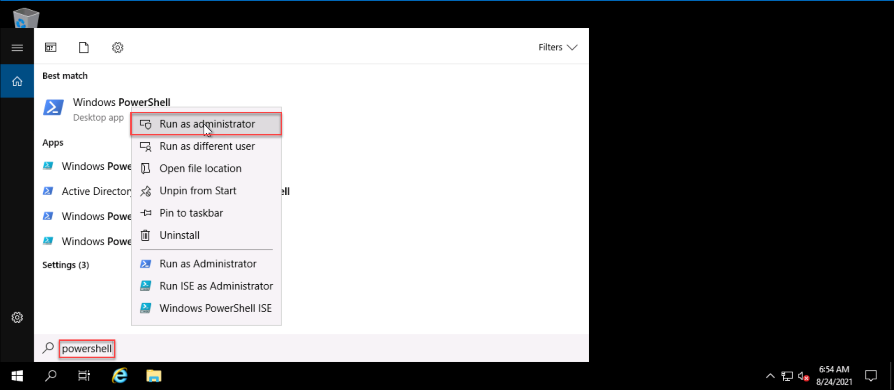

1. In **Windows PowerShell**, run the following command to manually run a sync cycle between Adatum’s on-premises AD and Azure AD. The **Delta** switch is used here so that only the updates are synchronized.    

		Start-ADSyncSyncCycle -PolicyType Delta
	
	‎**Note:** If for any reason the Domain Controller VM was restarted after the original full synchronization run, the Microsoft Azure AD Sync service may not have restarted. If this occurred, you’ll receive an error when you try to perform the forced sync above. If this occurs, you’ll need to start the Microsoft Azure AD Sync service first and then perform the forced synchronization. 

	

1. Once the synchronization process has successfully completed, minimize your PowerShell window (do not close it) and proceed to the next task. You will use PowerShell in the next task to validate some of the results of the directory synchronization.

1. Remain in LON-DC1-ID and proceed to the next task.
  

### Task 5 - Validate the Results of Directory Synchronization   

In this task, you will validate whether the changes you made earlier were synchronized from Adatum’s on-premises AD to Azure AD. You will validate the changes using the Microsoft 365 admin center, and then you’ll perform the same validations using Windows PowerShell. This gives you experience in validating synchronization using both the Microsoft 365 admin center GUI and PowerShell.

1. You should still be logged into LON-DC1-ID as the **Azureuser Administrator**

1. Now let’s examine the synchronization results for the groups that you updated in the previous tasks. In your **Edge** browser, if tabs exists for the **Microsoft Office Home** page and the **Microsoft 365 admin center**, then proceed to the next step.  

	Otherwise, enter **https://portal.office.com/** in the address bar to open the **Microsoft Office Home** page, log in as **holly@xxxxxZZZZZZ.onmicrosoft.com** (where xxxxxZZZZZZ is the tenant prefix provided by your lab hosting provider) with a password of **Pa55w.rd**, and then on the **Microsoft Office Home** page, select the **Admin** icon. 

1. In the **Microsoft 365 admin center**, in the left-hand navigation pane, select **Groups**, and then select **Active groups**. 

	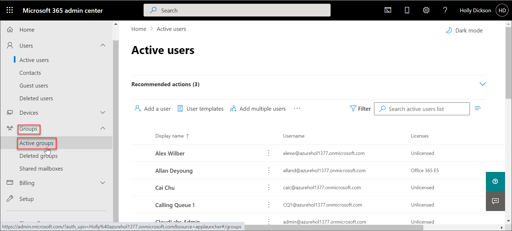

1. In the **Active groups** window, verify that the **Manufacturing** group appears in the Mail-enabled security tab, and that the **Print Operators** group does NOT appear. As mentioned previously, built-in groups such as the **Print Operators** security group are not synced from the on-premises AD to Azure AD, even when you add members to the group as you did in the earlier task.  

	**Note:** You may need to wait up to 10 minutes before the **Manufacturing** group appears. Continue to refresh the list until you see the group.  

	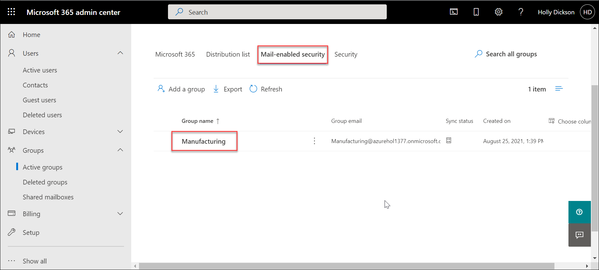

1. In the **Active groups** list, locate the **Manufacturing** group.  

	Scroll to the right and verify the group email address was changed during directory synchronization from **manufacturing@adatum.com** to **manufacturing@xxxxxZZZZZZ.onmicrosoft.com**, which is the group's mailbox in Exchange Online.  

	Hover your mouse over the icon in the **Sync status** column and verify that it indicates **Synced from on-premises**. 

	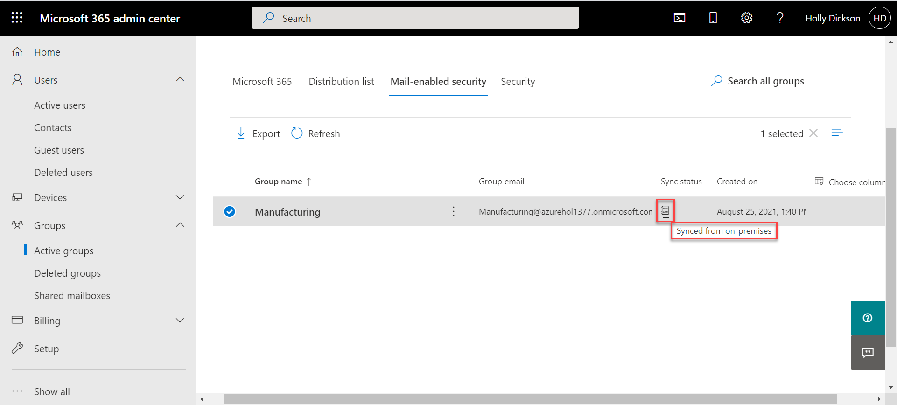

1. Select the **Manufacturing** group to open the **Manufacturing** pane. 

1. In the **Manufacturing** pane, under the Manufacturing title at the top of the pane, note that it’s a mail-enabled security group that contains three members. Also note the message indicating that you can only manage this group in your on-premises environment using either Active Directory users and groups (i.e. Users and Computers) or the on-premises Exchange admin center.  

	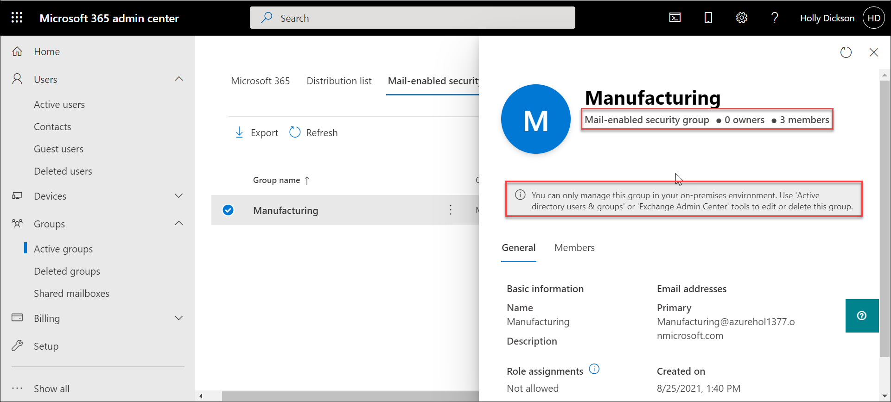

1. The window currently displays the **General** tab. Select the **Members** tab. Note that the group has no owner (the system did not automatically assign Holly Dickson as the group owner). Verify the three users that you added as members of the on-premises group (Bernardo, Dawn, and Charlie) have been synced up and are members of this cloud-based group as well. Close the **Manufacturing** pane.

	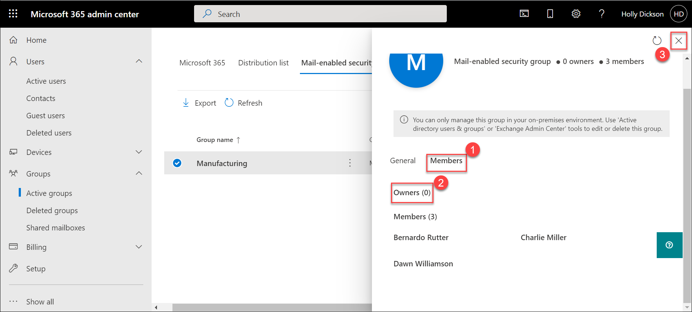

1. Now let’s examine this group using Windows PowerShell. If **Windows PowerShell** is already open on the taskbar, then select the PowerShell icon and proceed to the next step; otherwise, type **PowerShell** in the **Search** field on the taskbar and then right-click on the **Windows PowerShell** application and select **Run as administrator**. 

1. You should begin by running the following command that connects your PowerShell session to the Microsoft Online Service:   

		Connect-MsolService

1. In the **Sign in** dialog box, log in as **holly@xxxxxZZZZZZ.onmicrosoft.com** (where xxxxxZZZZZZ is the tenant prefix provided by your lab hosting provider) with a password of **Pa55w.rd**.   

	
	
	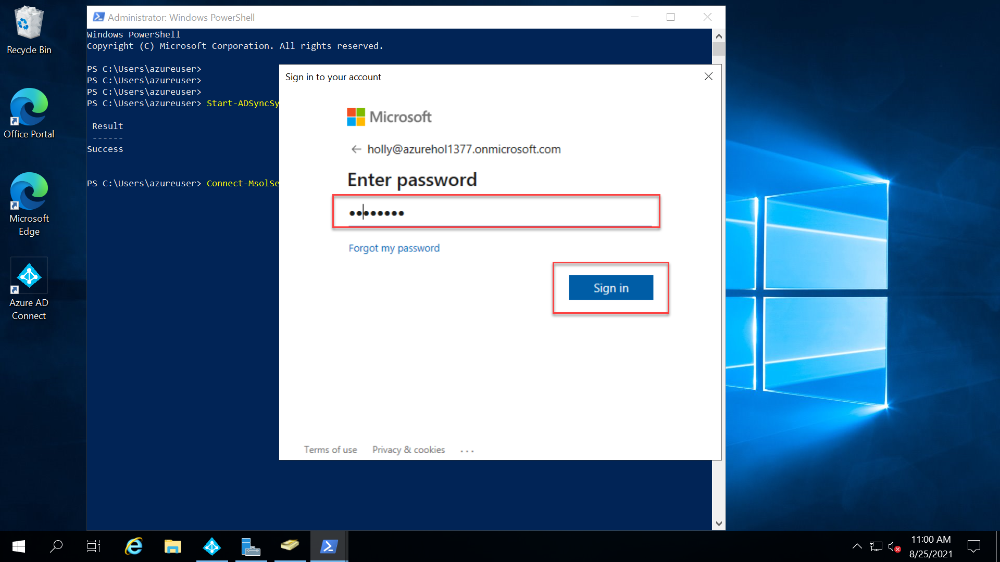
	
	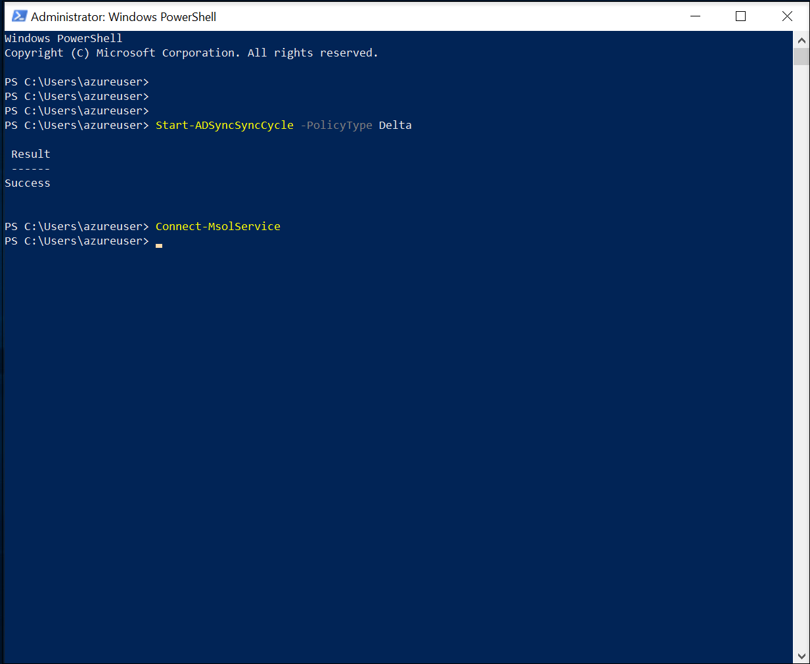

1. Run the following command that displays a list of all the Microsoft 365 groups:    

		Get-MsolGroup

	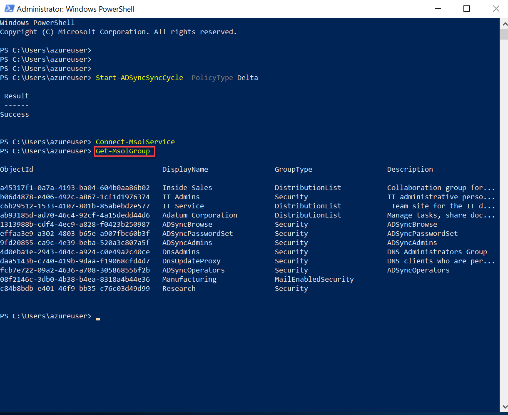

1. In the list of groups that’s displayed, you should verify that you can see the **Research** and **Manufacturing** groups, and that you do not see the  **Print Operators** group (this is the built-in group that did not synchronize from on-premises to Microsoft 365).

1. To verify that the group membership changes that you made in your on-premises Active Directory were synced to the **Research** group in Microsoft 365, you should copy the **ObjectID** for the **Research** group to your clipboard by dragging your mouse over the ObjectId string and then pressing **Ctrl-C**.    

	‎Then run the following command to display the members of this group. In the command, replace **<ObjectId>** with the value that you copied in the prior step by pressing **Ctrl-V** to paste in the value.  
	
		Get-MsolGroupMember -GroupObjectId <ObjectID>

	
	
1. Verify the membership of the Research group does **NOT** contain the following users that you earlier removed from the group in AD DS:  

	- Cai Chu 

	- Shannon Booth  

	- Tai Zecirevic  

1. Repeat steps 13-14 for the **Manufacturing** security group. In the **Manufacturing** group, you added the following members in AD DS, each of which you should see in the list of group members:  

	- Bernardo Rutter

	- Charlie Miller

	- Dawn Williamson

	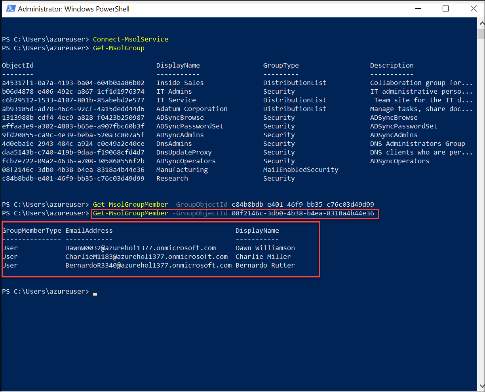
1. Once you have completed the validation steps, minimize your PowerShell window (do not close it) and proceed to the next Lab. 
 
# Proceed to Lab 4 - Exercise 3
 
